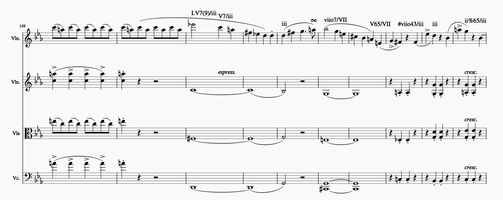

********************
Questions & Examples
********************

Although the guidelines for applying the DCML harmony standard to scores aim at
reducing contingency (i.e. the presence of several solutions) in order to
achieve high inter-annotator agreement, the standard needs to remain open enough
so that style-specific and case-to-case solutions are possible if required.

In other words: In many cases, the same harmonic passage can be annotated in
different ways. Which one the annotator chooses, depends on their interpretation
of the passage. Since different interpretations have different semantics
(meanings), we provide a collection of difficult and ambiguous cases. In every
case, we discuss the most obvious solutions and try to give convincing reasons
why we opted for a particular one. This resource is mainly targeted at
annotators for reference.

This section will be constantly extended with solved cases from our
`issue tracker <https://github.com/DCMLab/standards/issues>`_. If you come
across such a difficult case you are more than welcome to open an issue there
together with a screenshot which includes measure number, clefs, time and key
signatures, so that it can be discussed by the community and eventually added
to this collection here.

Secondary Keys
==============

The DCML harmony standard distinguishes between modulation (e.g. to scale degree
V: ``V.V7 I``) and temporary tonicization (``V7/V I/V``). This section is dealing
with examples for the latter case.

'Ternary' / 'Triple' dominants
------------------------------

In the following example, notating secondary dominants of ``/VII`` in m. 154f.
is, of course, fine:

    Mendelssohn: `String Quartet op. 12`, I. Adagio, non troppo, mm. 149-158

However, in order to express a continued tonicization of G minor (``iii``),
annotators might want to opt for the 'ternary key' notation, in the sense that
the standard allows for secondary keys within secondary keys. In order to
express this, we would write ``viio7/V/iii V65/V/iii``.

In addition, the example contains a mistake in m. 156 where ``iii`` should be
replaced by ``i6/iii``.

Phrase Structure
================

Phrase annotations should be considered as a separate, light-weight annotation
standard which can be combined with harmony labels or used separately.

Hierarchical phrase structure?
------------------------------

At the moment, we don't use hierarchical phrase segmentations. In other words,
annotators choose exactly one hierarchical level to be expressed in the
continuous segmentation using ``{`` and ``}``. Ideally, this level is chosen such
every cadence coincides with a phrase ending (but not forcibly vice-versa).
