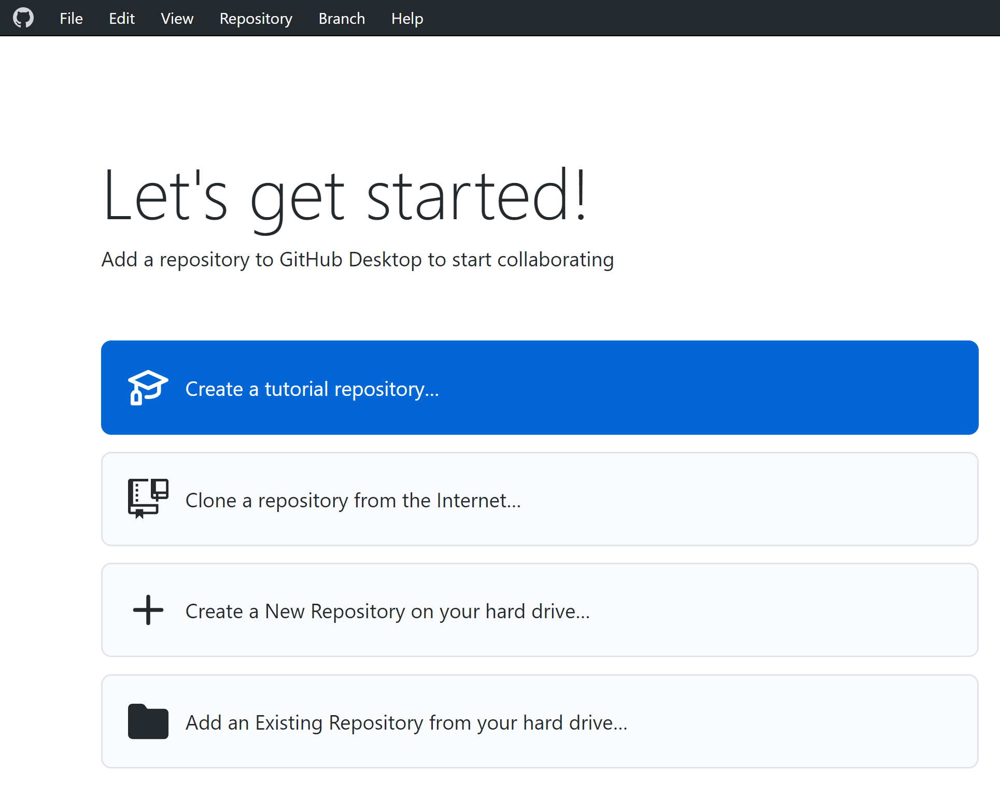
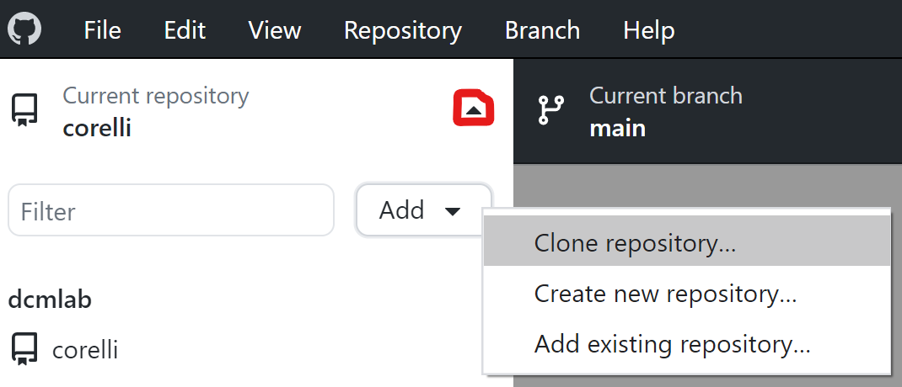
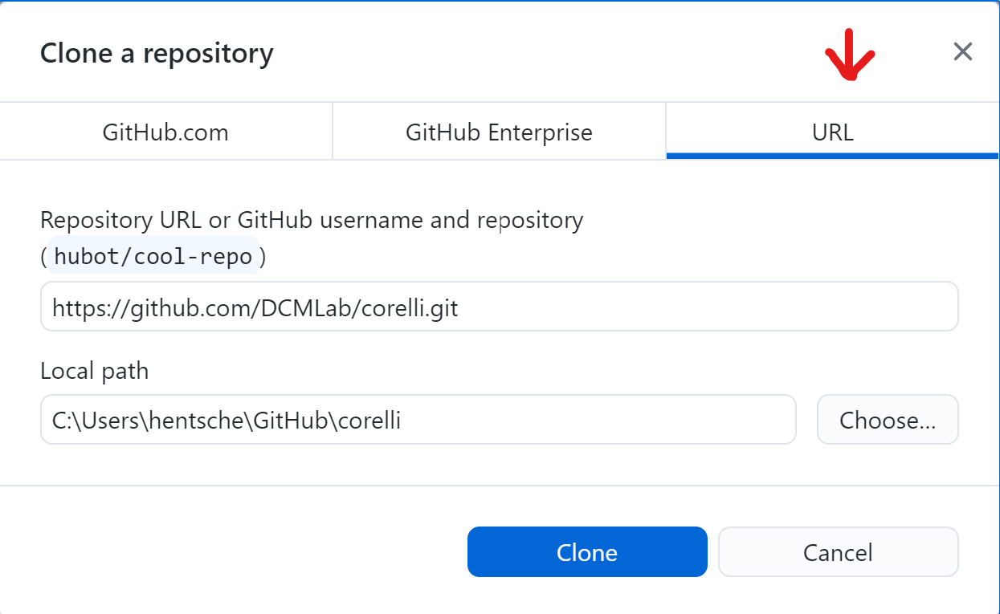
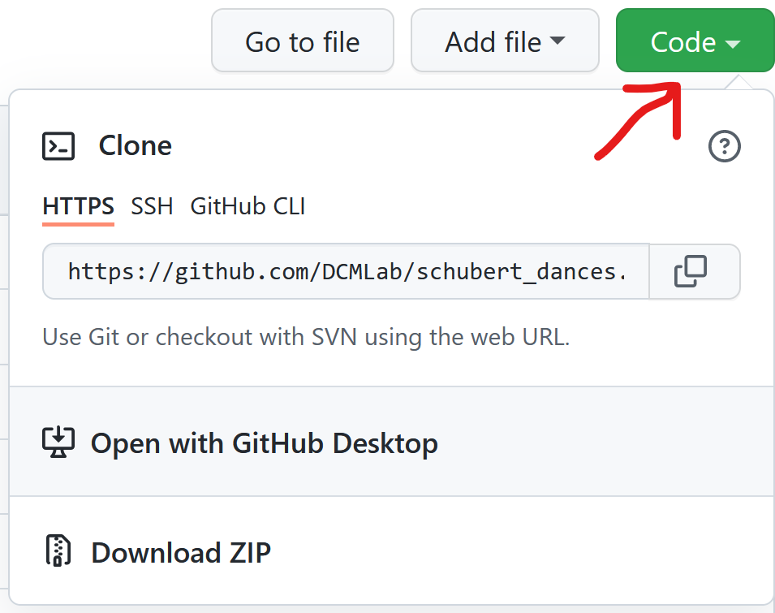

*******************
Quick Git Reference
*******************

.. contents:: Contents
   :local:

.. _git-intro:

Introduction
------------

Git is a version control system generally controlled via the command line.
GitHub is a hosting service for remote Git repositories. Since the DCML hosts
data on GitHub, a basic understanding of the Git workflow is relevant for annotators
and reviewers. There are plenty of resources (for example
`these videos <https://git-scm.com/doc>`__ or `this slideshow <https://rejahrehim.com/blog/git/workshop/presentation/slide/2019/12/08/choosing-the-right-git-branching-strategy.html#1>`__) for learning Git on the web, so this
is just a very quick guide. It might also be useful if you want to get a feel for how
familiar you are already with the git-related concepts.

.. admonition:: Navigating in the command line
  :class: caution

  In case you have never used the command line, you need to know that to run any ``git`` command (except ``clone``)
  you need to "be" within a git directory. Usually, the prompt (everything before the cursor) should tell you,
  where "you are", otherwise try ``pwd`` (on Windows: ``echo %cd%``). Use ``cd <folder_name_or_path>`` to change directory and ``ls``
  (on Windows: ``dir``) to show what is in the current WD (working directory). When typing cd and the first couple
  of letters of the folder you want to "go to", you can press [TAB] to autocomplete.

Installing Git
--------------

Check in your terminal if Git is already installed:

.. code-block:: console

  >>> git --version
  git version 2.29.2

If the command fails install Git with your system's package manger or head to
`this page <https://git-scm.com/book/en/v2/Getting-Started-Installing-Git>`__
for instructions.

.. _configuring_git:

Configuring Git
---------------

If this is the first time you are using Git, there are a few things you will need to set up before
you can really get started.

Setting up SSH
^^^^^^^^^^^^^^

In order to clone and push to private repositories (invisible to the public) you need to tell your Git installation
to use a cryptographic SSH key that identifies you. Simply follow the step-by-step instructions on GitHub
for the following to steps (make sure you have selected the correct operation system). It's  mostly a matter of
copying the commands into your terminal and pressing Enter:

#. GitHub docs on `Generating a new SSH key and adding it to the ssh-agent <https://docs.github.com/en/authentication/connecting-to-github-with-ssh/generating-a-new-ssh-key-and-adding-it-to-the-ssh-agent>`__
#. GitHub docs on `Adding a new SSH key to your GitHub account <https://docs.github.com/en/authentication/connecting-to-github-with-ssh/adding-a-new-ssh-key-to-your-github-account>`__

Merge or rebase?
^^^^^^^^^^^^^^^^

It happens to everyone: You push your latest commits but forgot to pull the latest changes that the bot made after
your last push: the local branch and the remote branch have diverged! The first time this happens you will be asked
how your Git should handle these solutions. Please use the following command to set the default behaviour to rebase:

  git config --global pull.rebase true

(If you want to set the behaviour for each repository individually, omit ``--global``.) Another thing that will make
your life a bit easier is the auto-stash behaviour. In short, it dispenses with the obligation to commit all your
local modifications when pulling. To activate it globally:

  git config --global rebase.autoStash true

Choose your favourite text editor
^^^^^^^^^^^^^^^^^^^^^^^^^^^^^^^^^

Sometimes you are asked to edit, store, and close a pre-configured commit message in a text editor.
`GitHub has a few example commands <git config --global pull.rebase true>`__ of how you can change which text editor
should be used.

Automatically creating remote branches
^^^^^^^^^^^^^^^^^^^^^^^^^^^^^^^^^^^^^^

Maybe you've also had this _eureka_ moment when you discovered that the command to create and track a new
remote branch can be shortened from

  git push --set-upstream-to origin <annotation_branch>

to

  git push -u origin <annotation_branch>

or even

  git push -u

but what if you never had to think about it anymore by having Git do it automatically for you?
If you would like that, you can set:

  git config --global push.autoSetupRemote true

if your Git version is >= 2.37 (late 2022).

Cloning a Repository from GitHub
--------------------------------

Go to the GitHub repository, click on the ``Code`` button, click on ``SSH``, and copy the URL:
|github_url|

Then, in your terminal, navigate (``cd [folder]``) to the place where you want
your local clone of the repository and do a simple ``git clone [copied URL]``.
If it fails, it might be because it's a private repo and you need to add your SSH key to GitHub first
(see the :ref:`configuring_git` section above). From now on you will
be constantly harmonizing the history of your local clone with the history of the
'origin', i.e. the 'remote' repository on GitHub.

Selecting the right Branch
--------------------------

Note that to apply any Git command, you need to navigate to any folder within
your local clone of the repository, otherwise you get ``fatal: not a git
repository (or any of the parent directories)``.

Git Branching Primer
^^^^^^^^^^^^^^^^^^^^

A Git repository often holds several versions, called 'branches', in parallel,
each with their own version history. The way the
`Git branching model <https://nvie.com/posts/a-successful-git-branching-model/>`_
is most often used, is that the branch called ``main``  (previously ``master``) holds the latest
*correct* version (production status), whereas all other branches are used for
experimenting and for applying as many changes as you want without changing the
``main``. Effectively that means that

* you apply your changes, 'commits', to a different branch: the commits are prepended
  to this branch's history;
* once you are done and want to integrate, 'merge', your branch into the
  ``main``, you create a Pull Request (PR);
* before the merge, the PR should be checked, 'reviewed', by someone else than
  yourself;
* if the PR passes all checks and reviews, it can be merged into the main branch,
  thus synchronising both histories. The merged branch can then be deleted.

What's my branch?
^^^^^^^^^^^^^^^^^

One of the most important Git commands is ``git status`` which tells you not only
what branch you are on (which branch is 'checked out'), but also by how much its
local history deviates from the history of the 'origin', i.e. the remote version
of the same branch on GitHub.

.. code-block:: console

  >>> git status
  On branch main
  Your branch is behind 'origin/main' by 2 commits, and can be fast-forwarded.
  (use "git pull" to update your local branch)

  nothing to commit, working tree clean

This message tells you that when you navigate to your local copy, the files you
see correspond to your local version of the ``main`` branch which is currently
missing two changes, 'commits', from the origin on GitHub. Git also suggests
to integrate, 'merge', these two commits by going ``git pull``.

Changing to a Different Branch
^^^^^^^^^^^^^^^^^^^^^^^^^^^^^^

Get a list of all available branches: ``git branch -a``. Choose the one where you
want to apply your changes to your local clone, e.g. the branch ``develop``, and
do ``git checkout [branch]``, e.g. ``git checkout develop``. If you don't get any
errors, the files of your local clone magically change to reflect this branch's
current (local!) state of history. A new ``git status`` will tell you whether
the local history diverges from the origin on GitHub.

Creating a new Branch
^^^^^^^^^^^^^^^^^^^^^

Consider which existing branch your new branch should be a copy of and check it
out, usually `main` (``git checkout main``). Then you can simply do
``git checkout -b [new_branch_name]`` to create a new branch. If you want to
upload, 'push', the new branch to GitHub, you can do a normal ``git push`` and
Git will tell you the command to use, e.g.:

.. code-block:: console

  >>> git push
  fatal: The current branch new_branch_name has no upstream branch.
  To push the current branch and set the remote as upstream, use

    git push --set-upstream origin new_branch_name

.. note::

    The :ref:`configuring_git` section suggests a couple of settings to make your like easier, such as for
    automatically setting up the new remote branch.

Applying Changes to the Repository
----------------------------------

First, decide which branch you want to apply changes to and check it out locally.
Generally speaking, you will never apply changes, 'commits', to the ``main`` branch.

Every time you have made changes that you want to register as 'commits' in your
local history, you will be using the same two commands:

.. code-block:: console

  git add MS3
  git commit -m "[COMMIT_MESSAGE]"

As a rule of thumb you should use these commands as often as possible for at least
two reasons:

#. Every change registered as a commit can be reverted individually.
#. Every commit has a meaningful COMMIT_MESSAGE that explains what has been
   changed, e.g. ``"Changing X, Y and Z, correcting their [PROBLEM]"``. The more
   individual changes you commit, the more comprehensible your history will be
   to others.

In the case of music scores, meaningful commit messages could be:

* "Corrected 'corrupt file' errors in measures 31, 32, and 37"
* "Added missing slurs from PDF"
* "updated all annotations to standard v2.2.1"
* "corrected syntactically incorrect labels in mm. 1, 17, and 96"

In general, when you commit changes not of a whole piece at once but instead to
a couple of measures, please include the measure numbers in the commit message
to facilitate review.

Uploading Changes to GitHub
---------------------------

Once you have finished your work for the day, you want to upload, 'push', all
your registered commits to the branch's origin on GitHub. First you will make
sure to integrate all commits that other people might have pushed to the remote
branch in between: ``git pull``. Git tries to integrate, 'rebase' or 'merge', the other
contributors' changes with your local changes. If you and someone else have made
changes in the same places of the same file, Git will let you know about this
'merge conflict' and ask you to resolve all of these conflicts. This is most
conveniently done in a text editor with Git integration (such as Atom) which
lets you navigate from conflict to conflict and make the decision between your
change ("Ours") and someone else's change("Theirs").

Once the pull succeeded, you can upload via ``git push``.

Applying Changes to the Origin Directly
---------------------------------------

Sometimes when you're feeling lazy, i.e. very rarely, you may apply changes to
the repository's origin on GitHub directly without taking the usual detour of
committing to your local clone and then pushing. This can be done via the
GitHub browser interface. Don't forget to pull such commits to your local clone.

Small Changes to a Text File
^^^^^^^^^^^^^^^^^^^^^^^^^^^^

.. |github_url| image:: img/github_url.png
.. |github_edit| image:: img/github_edit.png
.. |github_commit| image:: img/github_commit.png

Once again, make sure you are in the correct branch to apply your changes to by
selecting it from the drop-down menu on the left: |github_url|

Navigate to the file you want to change and click the edit button: |github_edit|

Now you may change the file directly in the browser and commit the change;
naturally you will specify a meaningful COMMIT_MESSAGE: |github_commit|

Overwriting a File with Changes
^^^^^^^^^^^^^^^^^^^^^^^^^^^^^^^

If you want to apply local changes to a file directly, you may drag-and-drop it
into GitHub. Once again, don't forget a meaningful COMMIT_MESSAGE.

Creating a GitHub account
=========================

Head to https://github.com/signup and follow the instructions.

GitHub Desktop
==============

GitHub Desktop is a GUI (graphical user interface) available for Windows and MacOS.
It dispenses with using git commands in the terminal but can (also)
lead to unwanted behaviour and needs to be handled with just the same care.

Installing GitHub Desktop
-------------------------

Head to https://desktop.github.com/, download the installer for your operation system and install it.

First start
-----------

Starting for the first time you are greeted by a screen similar to this one:

    Starting GitHub desktop for the first time

What most people will want to do is "Clone a repository from the internet".

Cloning a repository
--------------------

There are many ways to perform the task of creating a copy of a Git repository on your local disc.
You can use the menu ``File -> Clone repository...``. Or you open the repository panel and click on the repository
selector and click on ``Add -> Clone repository...``:

When you get to the clone window, usually you have a URL, so you click on the URL tab, paste the repository's URL,
and select where on your disc you want to create a local clone:

    Pasting a URL to create a local repository clone

Another simple way of cloning a GitHub repo is from the browser. For example, you can go to
https://github.com/DCMLab/schubert_dances and click on ``Code -> Open with GitHub Desktop``:

.. note:: You know that it worked when the interface looks like in the screenshot below, i.e. "Current repository"
    displays the name of the repo you have cloned. In the middle of the main frame you will see several buttons and
    one of them allows you to display the cloned files ("Show in Explorer/Finder").

The user interface
------------------

After cloning a repository, you will mostly operate with these three buttons:

The left one allows you to switch between different repositories that you have cloned. The middle one allows you to
select or create the branch you want to change. The right one allows you to exchange data between your local clone
and the origin (i.e. GitHub). Its principal actions are "Fetch origin", i.e. integrate changes from GitHub into your
local clone, and "Push origin" to upload all commits you made locally to GitHub. If you have created a new branch locally,
the button says "Publish branch" and allows for adding your branch to GitHub.

