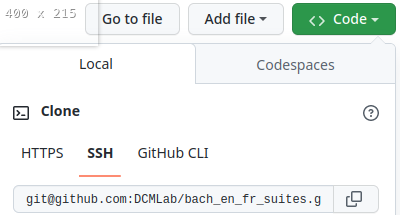
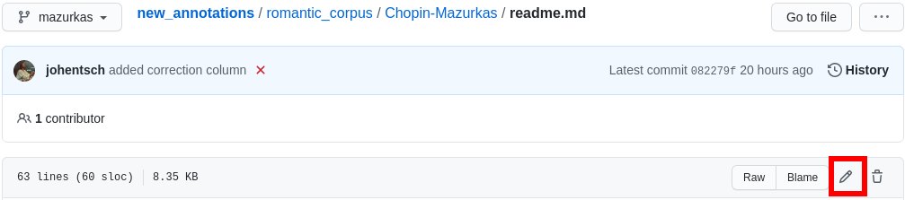
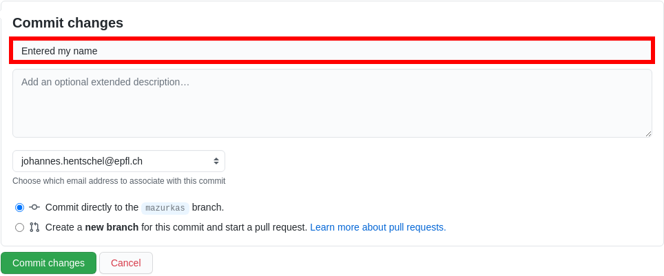
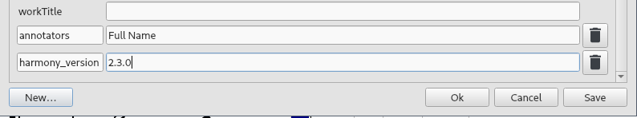
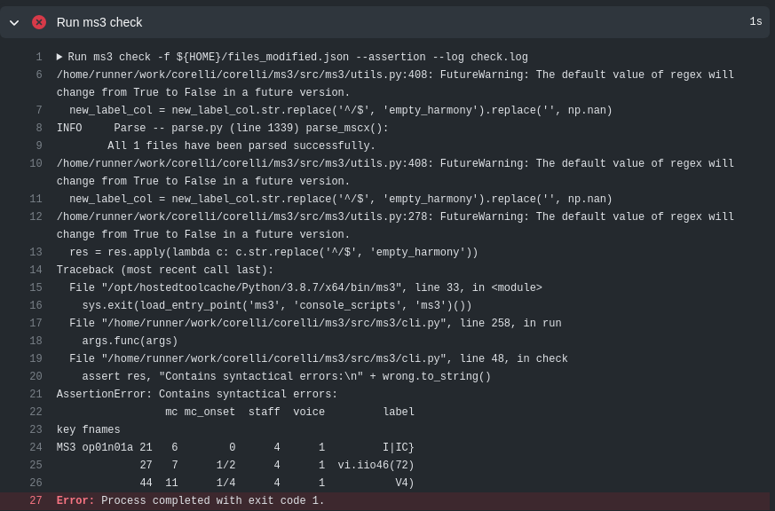
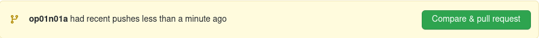
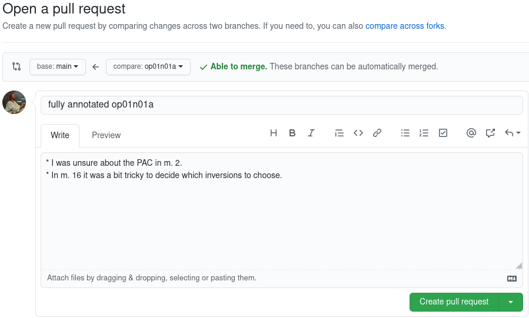
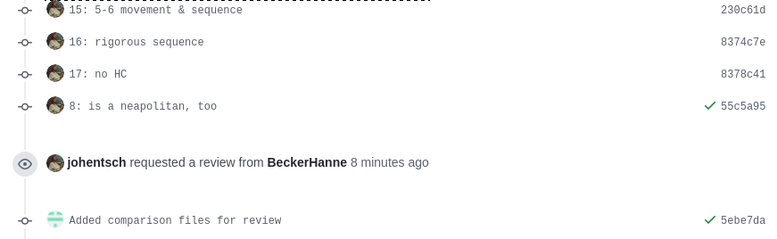
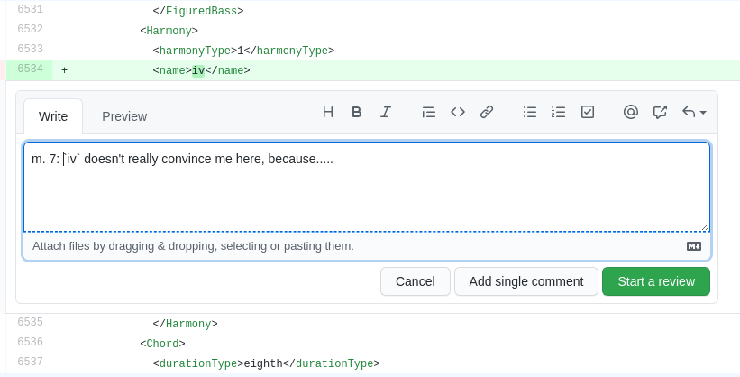

************************
Version control with Git
************************

.. _git-intro:

Quick Reference
===============

Git is a version control system generally controlled via the command line.
GitHub is a hosting service for remote Git repositories. Since the DCML hosts
data on GitHub, a basic understanding of the Git workflow is relevant for annotators
and reviewers. There are plenty of resources (for example
`these videos <https://git-scm.com/doc>`__ or `this slideshow <https://rejahrehim.com/blog/git/workshop/presentation/slide/2019/12/08/choosing-the-right-git-branching-strategy.html#1>`__) for learning Git on the web, so this
is just a very quick guide.

.. admonition:: Navigating in the command line
  :class: caution

  In case you have never used the command line, you need to know that to run any ``git`` command (except ``clone``)
  you need to "be" within a git directory. Usually, the prompt (everything before the cursor) should tell you,
  where "you are", otherwise try ``pwd`` (on Windows: ``echo %cd%``). Use ``cd <folder_name_or_path>`` to change directory and ``ls``
  (on Windows: ``dir``) to show what is in the current WD (working directory). When typing cd and the first couple
  of letters of the folder you want to "go to", you can press [TAB] to autocomplete.

Installing Git
--------------

Check in your terminal if Git is already installed:

.. code-block:: console

  >>> git --version
  git version 2.29.2

If the command fails install Git with your system's package manger or head to
`this page <https://git-scm.com/book/en/v2/Getting-Started-Installing-Git>`__
for instructions.

Cloning a Repository from GitHub
--------------------------------

Go to the GitHub repository, click on the ``Code`` button and copy the URL:
|github_url|

Then, in your terminal, navigate (``cd [folder]``) to the place where you want
your local clone of the repository and do a simple ``git clone [copied URL]``.
If asked, log in with your GitHub credentials. This copies the entire repository,
including the entire history and all branches to your disk. From now on you will
be constantly harmonizing the history of your local clone with the history of the
'origin', i.e. the 'remote' repository on GitHub.

.. note::

    In order to cache your credentials, avoiding to re-enter them for a certain
    period, config your Git, for example, to 3 hours:
    git config --global credential.helper 'cache --timeout=10800'

Selecting the right Branch
--------------------------

Note that to apply any Git command, you need to navigate to any folder within
your local clone of the repository, otherwise you get ``fatal: not a git
repository (or any of the parent directories)``.

Git Branching Primer
^^^^^^^^^^^^^^^^^^^^

A Git repository often holds several versions, called 'branches', in parallel,
each with their own version history. The way the
`Git branching model <https://nvie.com/posts/a-successful-git-branching-model/>`_
is most often used, is that the branch called ``main``  (previously ``master``) holds the latest
*correct* version (production status), whereas all other branches are used for
experimenting and for applying as many changes as you want without changing the
``main``. Effectively that means that

* you apply your changes, 'commits', to a different branch: the commits are prepended
  to this branch's history;
* once you are done and want to integrate, 'merge', your branch into the
  ``main``, you create a Pull Request (PR);
* before the merge, the PR should be checked, 'reviewed', by someone else than
  yourself;
* if the PR passes all checks and reviews, it can be merged into the main branch,
  thus synchronising both histories. The merged branch can then be deleted.

What's my branch?
^^^^^^^^^^^^^^^^^

One of the most important Git commands is ``git status`` which tells you not only
what branch you are on (which branch is 'checked out'), but also by how much its
local history deviates from the history of the 'origin', i.e. the remote version
of the same branch on GitHub.

.. code-block:: console

  >>> git status
  On branch main
  Your branch is behind 'origin/main' by 2 commits, and can be fast-forwarded.
  (use "git pull" to update your local branch)

  nothing to commit, working tree clean

This message tells you that when you navigate to your local copy, the files you
see correspond to your local version of the ``main`` branch which is currently
missing two changes, 'commits', from the origin on GitHub. Git also suggests
to integrate, 'merge', these two commits by going ``git pull``.

Changing to a Different Branch
^^^^^^^^^^^^^^^^^^^^^^^^^^^^^^

Get a list of all available branches: ``git branch -a``. Choose the one where you
want to apply your changes to your local clone, e.g. the branch ``develop``, and
do ``git checkout [branch]``, e.g. ``git checkout develop``. If you don't get any
errors, the files of your local clone magically change to reflect this branch's
current (local!) state of history. A new ``git status`` will tell you whether
the local history diverges from the origin on GitHub.

Creating a new Branch
^^^^^^^^^^^^^^^^^^^^^

Consider which existing branch your new branch should be a copy of and check it
out, usually `main` (``git checkout main``). Then you can simply do
``git checkout -b [new_branch_name]`` to create a new branch. If you want to
upload, 'push', the new branch to GitHub, you can do a normal ``git push`` and
Git will tell you the command to use, e.g.:

.. code-block:: console

  >>> git push
  fatal: The current branch new_branch_name has no upstream branch.
  To push the current branch and set the remote as upstream, use

    git push --set-upstream origin new_branch_name

Applying Changes to the Repository
----------------------------------

First, decide which branch you want to apply changes to and check it out locally.
Generally speaking, you will never apply changes, 'commits', to the ``main`` branch.

Every time you have made changes that you want to register as 'commits' in your
local history, you will be using the same two commands:

.. code-block:: console

  git add -A
  git commit -m "[COMMIT_MESSAGE]"

As a rule of thumb you should use these commands as often as possible for at least
two reasons:

#. Every change registered as a commit can be reverted individually.
#. Every commit has a meaningful COMMIT_MESSAGE that explains what has been
   changed, e.g. ``"Changing X, Y and Z, correcting their [PROBLEM]"``. The more
   individual changes you commit, the more comprehensible your history will be
   to others.

In the case of music scores, meaningful commit messages could be:

* "Corrected 'corrupt file' errors in measures 31, 32, and 37"
* "Added missing slurs from PDF"
* "updated all annotations to standard v2.2.1"
* "corrected syntactically incorrect labels in mm. 1, 17, and 96"

In general, when you commit changes not of a whole piece at once but instead to
a couple of measures, please include the measure numbers in the commit message
to facilitate review.

Uploading Changes to GitHub
---------------------------

Once you have finished your work for the day, you want to upload, 'push', all
your registered commits to the branch's origin on GitHub. First you will make
sure to integrate all commits that other people might have pushed to the remote
branch in between: ``git pull``. Git tries to integrate, 'merge', the other
contributors' changes with your local changes. If you and someone else have made
changes in the same places of the same file, Git will let you know about this
'merge conflict' and ask you to resolve all of these conflicts. This is most
conveniently done in a text editor with Git integration (such as Atom) which
lets you navigate from conflict to conflict and make the decision between your
change ("Ours") and someone else's change("Theirs").

Once the pull succeeded, you can upload via ``git push``.

Applying Changes to the Origin Directly
---------------------------------------

Sometimes when you're feeling lazy, i.e. very rarely, you may apply changes to
the repository's origin on GitHub directly without taking the usual detour of
committing to your local clone and then pushing. This can be done via the
GitHub browser interface. Don't forget to pull such commits to your local clone.

Small Changes to a Text File
^^^^^^^^^^^^^^^^^^^^^^^^^^^^

Once again, make sure you are in the correct branch to apply your changes to by
selecting it from the drop-down menu on the left: |github_url|

Navigate to the file you want to change and click the edit button: |github_edit|

Now you may change the file directly in the browser and commit the change;
naturally you will specify a meaningful COMMIT_MESSAGE: |github_commit|

Overwriting a File with Changes
^^^^^^^^^^^^^^^^^^^^^^^^^^^^^^^

If you want to apply local changes to a file directly, you may drag-and-drop it
into GitHub. Once again, don't forget a meaningful COMMIT_MESSAGE.

Annotation Workflow
===================

**Short Summary**

#. Annotator:

   * creates a new branch named after the file to be annotated
   * pushes annotations and corrects automatically detected errors
   * creates Pull Request (PR)

#. Reviewer:

   * merges annotator's PR, and then merges the automatically created files back into the annotation branch
   * reviews the annotations and commits every change separately
   * creates PR and requests a review by the annotator

#. Annotator:

   * Pulls the changes and goes through reviewer's commits in the PR
   * in case of disagreement, enters into discussion with reviewer until consensus is reached
   * pushes the respective changes and merges PR

More details can be found below.

Annotating
----------

Head to your local clone of the repository in which you want to annotate a piece and create a new branch with a
meaningful name. In this example, we want to annotate the first movement of Corelli's first trio sonata, so we call
the branch ``op01no01a``, according to the filename.

Once checked out, you're ready to start annotating. Please start by adding to the MuseScore file your name and the
version of the annotation standard you are using (currently ``2.3.0``). To do that, open the menu
``File -> Score Properties...`` and add the information by altering or otherwise creating the fields
``annotators`` and ``harmony_version`` with the corresponding values, as displayed below:

    Entering metadata in MuseScore

Annotate your piece and commit your changes locally. Everytime you push your changes to GitHub, your new labels
will be checked automatically and you can see immediately if there are any syntactic errors. Simply head to the
GitHub repository and click on the ``Actions`` tab. There you will see your last commit with a small coloured symbol:

:yellow: Check in progress
:green: Everything OK
:red: Syntactical error(s) detected

In the latter case, click on the failed check to get to this view:

.. figure:: img/github_check_perform_check.png
    :alt: Click on "perform_check"
    :scale: 80%

    Click on "perform_check"

Scroll down until you see the output of the checking algorithm:

    Code output; syntactical errors listed in the end

The table shows the filename ``fnames``, the measure count ``MC`` which corresponds to the bar number that MuseScore displays in the
status bar on the bottom left (not always identical to the measure number (MN) in the score), the incorrect
label's offset from the barline, ``mc_onset``, measured in fractions of a whole note, and the incorrect label. From here on,
simply correct the labels, commit and push again, and the check should pass this time.

Once you have finished your work and want to submit it for review,
head to the main page of the GitHub repository where we should see a banner allowing you to quickly create
a pull request:

    GitHub offering to creat a new pull request

Otherwise, head to the ``Pull requests`` tab, click on "New pull request" and select your branch accordingly, like
this:

    Giving the new pull request a meaningful title

Give the pull request a meaningful name and feel free to add anything worth knowing below. Once you confirm with
the green button "Create pull request", you're done.

Reviewing
---------

#. Merge PR with new annotations
#. wait until ``ms3-bot`` automatically pushed the new annotation tables
#. the new annotation tables need to get into the annotation/review branch to create comparison files after your review:

   * shortcut: in the updated review branch, do ``git pull origin main``; your local main is not updated!
   * thoroughly: checkout main, ``git pull``, checkout review branch, ``git merge main``

#. Before the review, make sure this had the desired effect by verifying the folder ``harmonies`` contains the
   annotation table for the file to be reviewed (i.e., a TSV file by the same name)
#. review files and commit every change individually with measure number and explanation, e.g. ``"13: vii should be #vii``
#. add your initials to the file's metadata in the field `reviewers` (``File -> Score Properties``, add the field if missing)
#. push everything and create pull request (PR) -> comparison MuseScore file gets pushed automatically
#. request PR review by annotator

Reviewing review & reaching expert consensus
--------------------------------------------

Once your file(s) got reviewed, the reviewer creates a pull request (PR) and requests your review. You should
receive an e-mail notification, if not, please check your GitHub settings. Now your task is to go through all changes
and see whether you agree with all of them. Here is how:

How to review a review
^^^^^^^^^^^^^^^^^^^^^^

Open the PR from your notification e-mail or go to GitHub and open the ``Pull requests`` tab where you should see it.
The PR lets you inspect all changes and start discussions. Most importantly, after opening it, you will see all
commits made by the reviewer:

    List of commits made by the reviewer

Clicking on one of them will show you the corresponding changes in the MuseScore file. But it might be hard for
you to assess the changes without looking at the actual music. Therefore:

The last commit, called "Added comparison files for review", was made automatically by ``ms3-bot``,
creating an additional MuseScore file with the suffix ``_reviewed``. Therefore, the first thing you want to do to
review the review, is locally checkout and pull the branch corresponding to the PR
(it should be the same you created for annotating). Now you should have the comparison MuseScore file  ``_reviewed``
in your local clone and can open it in MuseScore. It shows unchanged labels in black,
labels removed by the reviewer in red, and labels added by the reviewer in green.
The sole purpose of this file is to help you with the review of the review and will be deleted
at some later point (it is not listed in the metadata either).

How to finish the review of the review
^^^^^^^^^^^^^^^^^^^^^^^^^^^^^^^^^^^^^^

Now you can go through the list of commits one by one and check how they play out in the comparison file. For every
change that you agree with, there is nothing you need to do. In cases where you don't agree, you write a comment
on GitHub and discuss with the reviewer until you find a solution that satisfies both analytical views. If consensus
has been reached, you need to make the change to the *original* file (not the ``_reviewed`` file) and commit it.
Once you push the changes, they will be included into the PR and the comparison file will be updated accordingly.
As soon as the original file contains a set of annotations that you and the reviewer agree to be the best possible
solution, your reward is the satisfaction of pressing the green button to merge the PR.

How to start a discussion
^^^^^^^^^^^^^^^^^^^^^^^^^

To start a discussion, click on the commit you disagree with. On the left you see in red your previous version and
on the left, in green, the changes made by the reviewer. Hovering over the code lines, you will see a blue plus
that lets you add your comment. It is important that you add the measure number so that the reviewer can find
the spot and react to your comment.

    Starting a discussion by commenting the reviewer's commit

The comments and resulting discussions will be visible in the PR's "Conversation" tab (under the list of commits). Don't forget
to press the Subscribe button on the right to get informed about reactions to your comments.

