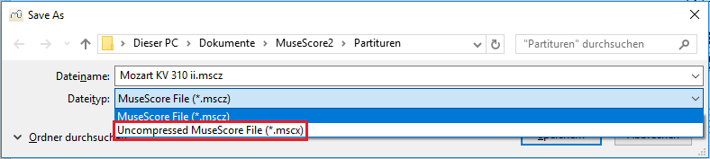
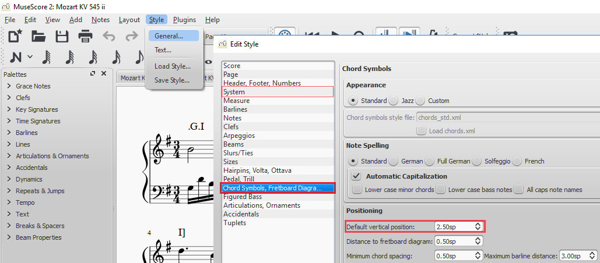

Using MuseScore
===============

    If you are not familiar with the software, know that ``F12`` opens
    the navigator which facilitates navigating. If you prefer scrolling
    through pages vertically instead of horizontally, change
    ``Edit -> Preferences... -> Canvas -> Scroll pages``

There are two types of MuseScore files. The software saves files
automatically in the compressed format ``.mscz``, creating smaller file
sizes. However, we work with the uncompressed ``.mscx`` format because
it represents text files. Please make sure to save the annotated score in
this format by using ``Files -> Save As...`` and selecting the
"Uncompressed MuseScore File (\*.mscx)" format.

How to annotate
---------------

To type the chord symbols into the score comfortably, click once on one
note of the first harmony in the **upper staff** and press ``Ctrl + K``
which will activate a cursor above the system. After typing in the chord
expression, press ``Space`` to go to the next note or the next beat.
``Shift + Space`` will bring you back to the prior event, and ``Tab`` to
beat 1 of the next measure. And, importantly, ``Esc`` ends the chord
editing mode.

.. note::

    All labels have to be attached to the upmost (i.e. right hand)
    staff. Within this staff, it does not matter to which voice they are
    attached.

Editing annotations
-------------------

If you want to change a chord symbol, double click (or tap) on it to get
into chord edit mode. To delete one, get out of edit mode, click on the
symbol once to select it, and press ``Delete``.

If you want to change the beat/position of a symbol, it is important not
to drag it horizontally because it stays linked to the moment where you
entered it. Therefore, you need to delete it and enter it anew on the
right position. Of course, the quickest way to do this is to select the label,
cut it with ``Ctrl + X``, select a note in the correct position and
insert it with ``Ctrl + V``.

Selecting a position where there is no note or rest
---------------------------------------------------

It is as simple as pressing Ctrl+3 for moving the cursor by a 16th,
Ctrl+4 for an 8th and so on (same values as for note entry).

.. _copying-several-annotations:

Copying several annotations
---------------------------

If you find an exact repetition, make sure, it actually is an exact
repetition first before copying symbols. Then, go to the symbols you
want to copy.

.. note::

    If they expand over more than one system, you will have
    to change "Page view" to "Continuous View". Generally, you will end up
    in a different measure than expected and you can easily navigate to your
    measure using ``Ctrl + F`` and typing the measure number.

To select the chord symbols (or anything else for that matter), press
``Shift`` to draw a frame around the symbols with your mouse (or touch
device). Copy with ``Ctrl + C``, then select the first beat where you
want to paste the symbols and press ``Ctrl + V``. It is important that
no other symbols exist in the range where you paste to avoid duplicates
or twofold annotations for the same position.

Visibility
----------

Although not important for the computerised analysis of your
annotations, it is preferrable to arrange them in a human-readable way.

* If two expressions overlap horizontally, just drag the first one up or down
  with your mouse (or touch device). Make sure to leave any edit mode first,
  using ``Esc``.
* If expressions overlap with notes, you can drag them manually as well. But if
  this is often the case, you might want to
* change the distance between the chord symbols and the respective system for
  the entire document by changing the value of ``Style -> General... -> Chord Symbols, Fretboard Diagrams -> Default vertical position``.
  A usable value might lie around ``6.00sp``. If the distance is good but
  chord symbols overlap with the above system, you might want to
* change the distance between all systems by raising the value of
  ``Style -> General... -> Page -> Min. system distance``. Note that you
  might have to adjust ``Max. system distance`` if you need high values.

