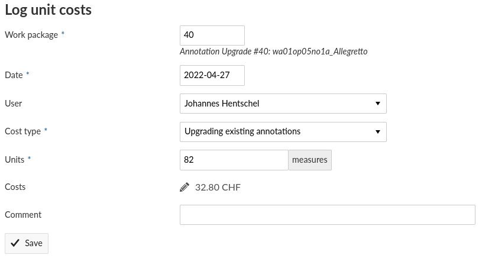

****************************************
Work package management with OpenProject
****************************************

To facilitate assigning work packages, reviews, and accounting, we are using a self-hosted
`OpenProject instance <https://op-musicology.epfl.ch>`__.

Basic Principle
===============

Independent on which task you are performing, you simply need to remember to change the status before and after working
on a piece. This way it is possible to self-assign without duplicating any work. Each package corresponds to one piece
that needs to be annotated (package type ``New annotations``) or upgraded (package type ``Annotation upgrade``).
Each package traverses the following statuses, in this order:

* ``Not available``: to be disregarded for now
* ``Available``: to be (self-)assigned; the "Assignee" field should be empty and once filled the status needs to be changed to
* ``In progress``: currently being undertaken by the person marked in the "Assignee" field
* ``Needs review``: the annotator/upgrader has finished and the person (self-)assigned in the "Reviewer" field should
  begin their review
* ``Under review``: review & subsequent discussions currently in progress
* ``Done``: PR has been merged.

User Interface
==============

.. figure:: img/op_overview.png
     :alt: Overview over OpenProject's user interface
     :scale: 99%

1. Make sure to access the project ``Harmony Annotations`` (you need to be added by an admin).
2. Go to ``Work packages``.
3. To see or alter information of a work package, click on its ID or use the blue menu that appears when hovering
   over the right end of the row.
4. Use the filters to see only particular work packages.
5. Use the menu ``... -> Save as...`` to save a filtered view.
6. Find saved views in the ``Work packages`` sub-menu

Taking on an assignment
=======================

1. In the work package sub-menu, use the ``Assigned to me`` default view to check if any of the packages assigned to you
   require your action. Finish any open tasks before taking on new ones.
2. Use the view ``To Do`` to display work packages that have status ``Available`` or ``Needs review``.
3. Assign yourself, change the status, and the date.
4. Perform the task and include the ID of the work package in the description of your Pull Request (see below).
5. Change the status, log the costs.
6. Follow the progress of the Pull Request and the work package and, if needed, ping fellow annotators to undertake the review.

Only when the Pull Request is merged and the work package status set to ``Done`` can assignee and reviewer invoice the task.

Taking on ``New annotations`` or an ``Annotation upgrade``
----------------------------------------------------------

.. figure:: img/op_assignment.png
     :alt: Details page of a work package
     :scale: 50%

Open the details of the corresponding work package.

1. Change the status from ``Available`` to ``In progress``.
2. Add your name to the field "Assignee" (which should be empty).
3. Set the "Start date" to ``Today``.

**Once you have completed the job:**

.. figure:: img/op_github.png
     :alt: The GitHub pane of a work package
     :scale: 50%

1. You want the Pull Request to show up in the "GitHub" pane of the work packages so that the reviewer can easily find it.
2. For that you simply find the package's ID, (e.g. 40) and include ``OP#40`` (or whatever the ID is) in the description of your PR.
3. Then take note of the number of measures and open the menu ``More -> Log unit costs`` (see below).

Taking on a review
------------------

.. figure:: img/op_review.png
     :alt: How to assign a work package as a reviewer
     :scale: 50%

Open the details of the corresponding work package.

1. Change the status from ``Needs review`` to ``Under review``.
2. If you hadn't been assigned already, add your name to the field "Reviewer".
3. Set the "Finish date" to something like in a week from now.
4. Find the Pull Request in the GitHub pane.
5. Once the review is finished, log the costs.

Logging unit costs
==================

OpenProject computes the amount to be invoiced for each work package based on the number of measures.

1. Open the work package in question and find the number in the field "Measures".
2. Open the context menu (``...`` or ``More``) and select ``Log unit costs``.
3. In the mask that opens,

   * under ``Cost type`` select the kind of service you provided (and thus the associated tariff).
   * enter the number of measures in the field ``Units``

4. Click "Save".

