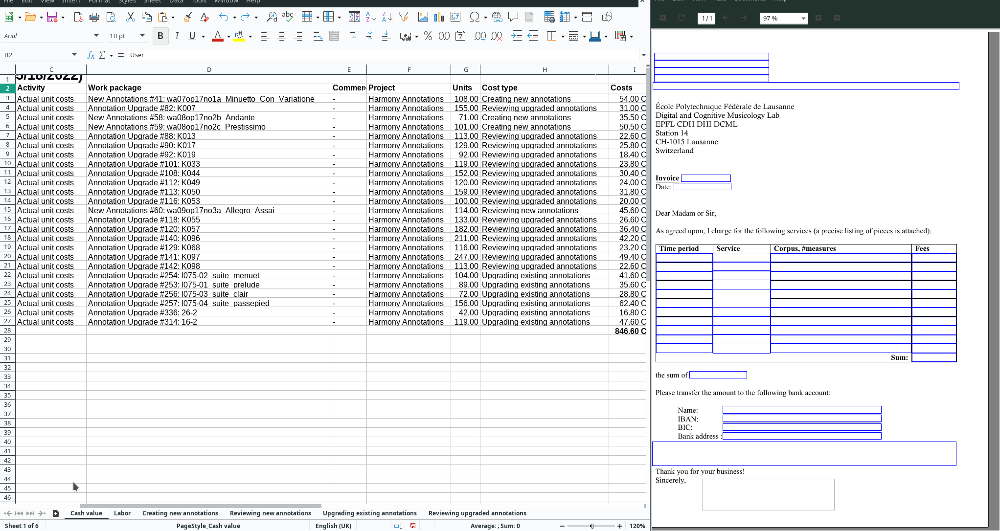
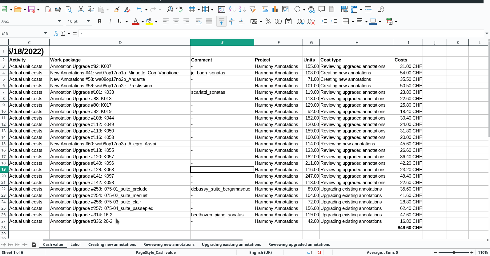

****************************************
Work package management with OpenProject
****************************************

To facilitate assigning work packages, reviews, and accounting, we are using a self-hosted
`OpenProject instance <https://op-musicology.epfl.ch>`__.

.. contents:: Contents
   :local:

User Interface
==============

.. figure:: img/op_overview.png
     :alt: Overview over OpenProject's user interface

1. Make sure to access the project ``Harmony Annotations`` (you need to be added by an admin).
2. Go to ``Work packages``.
3. To see or alter information of a work package, click on its ID or use the blue menu that appears when hovering
   over the right end of the row.
4. Use the filters to see only particular work packages.
5. Use the menu ``... -> Save as...`` to save a filtered view.
6. Find saved views in the ``Work packages`` sub-menu.
7. ``Time and costs`` is where you can :ref:`create cost reports <creating_cost_report>`.

Work Packages (WPs)
===================

Each package corresponds to one piece that needs to be annotated (package type ``New annotations``)
or upgraded (package type ``Annotation upgrade``). Independent on which task you are performing, you simply need to
remember to change the status **before and after** working on a piece. This way it is possible to self-assign without
duplicating any work.

Life cycle
----------

Each package traverses the following statuses, in this order:

* ``Not available``: to be disregarded for now
* ``Available``: to be (self-)assigned; the ``Assignee`` field should be empty and, once filled, the status needs to be changed to
* ``In progress``: currently being undertaken by the person marked in the ``Assignee`` field
* ``Needs review``: the annotator/upgrader has finished and the person (self-)assigned in the ``Reviewer`` field should
  begin their review
* ``Under review``: review & subsequent discussions currently in progress (refer to the PR).
* ``Done``: ``Reviewer`` has approved the PR which consequently has been merged by the ``Assignee``. ``Finish date``
  is set to the current date.

The responsibility lies with the ``Assignee`` to make this life cycle as long as necessary and as short as possible.
This might involve contacting fellow annotators in case the workflow has gotten stuck.

.. _op_workflow:

Workflow
--------

Decide what you want to work on.
  As a general principle, please give preference to finalizing tasks before
  addressing new work packages (WPs). Both ``Assignee`` and ``Reviewer`` may only invoice
  work packages that have reached the status ``Done``, meaning that the associated Pull Request (PR) has been reviewed
  and merged.

  * First, make sure you have addressed all comments and new commits in the PRs in which you
    are involved (always make sure you are subscribed on GitHub in order to receive notifications).
  * When all PRs have been addressed, please use OpenProject's filter functionality to see if

    - you are the ``Assignee`` for packages with status ``Available``
    - you are the ``Reviewer`` for packages with status ``Needs review``

    Usually, if this is the case, it is because of an agreement you have made with DCML. The default is that people
    self-assign (in which case the status should be ``In progress`` or ``Under review``).
  * If your desk is clean and you want to take on a new task, use the ``Work packages -> To Do`` view.
    Please give preference to the packages with status ``Needs review`` in order to finalize them quickly, to make
    them invoiceable, and to get them out of our way.

Self-assign.
  * If you are addressing a package with status ``Needs review``, the ``Reviewer`` field needs to be empty so
    you can enter your name and set the status to ``Under review``. Otherwise, the review has been assigned to
    someone else. For details, :ref:`see below <taking_on_a_review>`.
  * If you are addressing a package with status ``Available``, the ``Assignee`` field needs to be empty so
    you can enter your name and set the status to ``In progress`` **and the Start date to "Today"**.
    Otherwise, the task has been assigned to someone else. For details, :ref:`see below <taking_on_a_task>`.

Perform the task according to the usual :doc:`GitHub workflow <../git/git>`.
  * If you are the WP's ``Assignee`` you end your task by creating a Pull Request that you link to the WP by including
    the WP's URL in the PR's description (:ref:`see screencast below <linking_pr>`).
  * If you are the WP's ``Reviewer`` your task ideally ends with you having committed to the PR to the point where you
    approve it (:ref:`see screencast below <reviewing_pr>`).

Change the WP's status and :ref:`log the costs <logging_costs>`.
  * If you are the WP's ``Assignee``, you change the status to ``Needs review``. If it takes too long (say two weeks)
    for anyone to take on the review, please ping your fellow annotators.
  * If you are the WP's ``Reviewer``, there is nothing for you to change in the work package. If, after your approval,
    the ``Assignee`` takes unreasonably long to merge the PR and set the status to ``Done`` (thus allowing you to
    invoice your work) you may ping them politely.

Finalize the WP.
  Once the ``Reviewer`` has approved the PR and the ``Assignee`` has reviewed and agreed with their changes, it is
  the ``Assignee`` you merges the PR and enables the package for invoicing by performing two equally important steps:

  * The WP's status is changed to ``Done`` so it can show up in the :ref:`cost reports <creating_cost_report>`.
  * The WP's ``Finish date`` needs to be set to "Today" so as to allow for filtering out previously invoiced
    cost items.

Taking on an assignment
=======================

Once more, the :ref:`workflow described above <op_workflow>` in a nutshell:

1. In the work package sub-menu, use the ``Assigned to me`` default view to check if any of the packages assigned to you
   require your action. Finish any open tasks before taking on new ones.
2. Use the view ``To Do`` to display work packages that have status ``Available`` or ``Needs review``.
3. Assign yourself, change the status.

   * If you are the ``Assignee``, also change the ``Start date``.

4. Perform the task. If you are the ``Assignee``:

   * include the URL of the work package in the description of your Pull Request, and
   * change the status to ``Needs review``.

5. Log the costs.
6. Follow the progress of the Pull Request and help it to be merged soon.
7. Once the PR has been reviewed and a consensual solution found, the ``Assignee`` merges the PR, sets the status to
   ``Done`` and the ``Finish date`` to the current date. Only at this point can assignee and reviewer
   :ref:`invoice the task <writing_invoices>`.

.. _taking_on_a_task:

Taking on ``New annotations`` or an ``Annotation upgrade``
----------------------------------------------------------

Before the task
~~~~~~~~~~~~~~~

.. figure:: img/op_assignment.png
     :alt: Details page of a work package
     :scale: 50%

Open the details of the corresponding work package.

1. Change the status from ``Available`` to ``In progress``.
2. Add your name to the field "Assignee" (which should be empty).
3. Set the "Start date" to ``Today``.

After the task
~~~~~~~~~~~~~~

.. figure:: img/op_github.png
     :alt: The GitHub pane of a work package
     :scale: 50%

1. You want the Pull Request to show up in the "GitHub" pane of the work packages so that the reviewer can easily find it.
2. For that you simply open the work package and copy its URL into the description of your PR (see screencast).  Compared
   to using the short string that OP suggests to you (e.g. ``OP#81`` for the WP with ID 81) the URL has the advantage
   that when you merge the PR later, you get to the WP more quickly to set the status to ``Done``.
3. Then take note of the number of measures and :ref:`log the costs <logging_costs>`.
4. Once your PR has been approved and you agree with the reviewer's changes, you are responsible for merging the PR,
   changing the WP's status to ``Done`` and, importantly, setting the ``Finish date`` to "Today".

.. _linking_pr:

   Linking a Pull Request to a Work Package. It doesn't matter that in this case the PR is already merged and the
   package marked as ``Done``.

.. _taking_on_a_review:

Taking on a review
------------------

.. figure:: img/op_review.png
     :alt: How to assign a work package as a reviewer
     :scale: 50%

Open the details of the corresponding work package.

1. Change the status from ``Needs review`` to ``Under review``.
2. If you hadn't been assigned already, add your name to the field "Reviewer".
3. Find the Pull Request in the GitHub pane.
4. Once the review is finished, approve the PR (unless you need to request changes) and
   :ref:`log the costs <logging_costs>`.
5. From here on, be attentive to any comments and discussion points raised by the ``Assignee`` and make sure to
   find consensus as efficiently as possible. It is a matter of teamwork to get the PR to a mergeable state and
   thus the work package to status ``Done``, invoiceable for both.

.. _reviewing_pr:

.. figure:: img/reviewing_pr.gif
   :alt: How to approve a PR

   How to approve a PR (the screencast skips the actual review process which usually includes commits, comments, and
   metadata update).

.. _logging_costs:

Logging unit costs
==================

OpenProject computes the amount to be invoiced for each work package based on the number of measures.

1. Open the Work Package in question and find the number in the field "Measures". In case the status is ``Done``,
   please verify that the ``Finish date`` has been set upon merging the PR.
2. Open the context menu (``...`` or ``More``) and select ``Log unit costs``.
3. In the mask that opens,

   * under ``Cost type`` select the kind of service you provided (and thus the associated tariff).
   * enter the number of measures in the field ``Units``
   * for convenience (see the section on :ref:`writing invoices <invoicing>`), write the repository name in the
     ``Comment`` field.

4. Click "Save".

   How to log unit costs. Here, the WPs in questions did not have a ``Finish date`` yet. For convenience, the respective
   column is added to the view but the date can also be entered in the WP's Overview. Here, the annotator is not
   including the repository name (scarlatti_sonatas) in the ``Comment`` field although it would be a good idea.

.. _writing_invoices:

Writing invoices
================

As you know already, you can invoice your finalized tasks at any given moment. Tasks are finalized when a Work Package's
``Assignee`` and ``Reviewer`` reach expert consensus on a set of annotations. Therefore, you can invoice tasks only
after the respective WP has reached the status ``Done``.

Starting from May 2022, all invoices should be based exclusively on cost reports generated by OpenProject.
Therefore it is important that you don't forget to :ref:`log your costs <logging_costs>` after performing a task
and that ``Assignee`` set the WP's ``Finish`` date to "Today" when setting the status to ``Done``.

.. _creating_cost_report:

Creating a cost report
----------------------

.. figure:: img/cost_report.gif
   :alt: How to generate a cost report.

   How to generate a cost report.

#. Head to the "Time and Costs" menu and select the "Ready for invoicing" view.
#. Add the filter ``Finish date >= [day after your last invoice]``. If this is your :ref:`first invoice <first_invoice>`,
   you can skip this step.
#. Click "Apply" and verify that the displayed unit costs indeed cover the finalized WPs you have undertaken. If a WP
   is not shown, at least one of these three things must be true:

   * You have not :ref:`logged your costs <logging_costs>`.
   * The WP has not reached the status ``Done`` yet.
   * The WP is missing its ``Finished date`` (or the date does not match your filter).

#. Click on "Export XLS" to export the Excel file to be attached to your invoice.
#. Use the different sheets contained in the Excel file to sum up measures and costs to come up with the items
   for the invoice (see below).

.. _invoicing:

Writing an invoice
------------------

For the actual invoice you can use `our template <https://drive.switch.ch/index.php/s/lfNUOJ987AvFuvg>`__
or your own as long as it contains

* your address
* the current date
* an arbitrary invoice number
* one item per repository per type of service (e.g. one for "Creating new annotations" and one for "Reviewing new annotations")
* for each item, the accumulated number of bars and aggregated costs (e.g. "Creating new annotations | scarlatti_sonatas (321 bars) | 160.50 CHF")
* the total sum
* your bank details
* your signature

Once you have the invoice PDF ready, please give both files the same name starting with a backwards (``YYMMDD``) date,
for example: ``220519_Johannes_Hentschel.pdf`` for the invoice and ``220519_Johannes_Hentschel.xls`` for the
cost report.

To compute the individual per-repository items easily, simply open the exported XLS (Excel) file and pick one
of the two methods described in the following.

.. note::

   This following screencasts use LibreOffice to open the cost report. The process of sorting and creating sums or
   pivot tables should work exactly the same way in other spreadsheets such as Excel or Numbers.

From cost report to invoice items - Variant 1
~~~~~~~~~~~~~~~~~~~~~~~~~~~~~~~~~~~~~~~~~~~~~

The first variant is easier but more work.

The cost report contains one sheet per cost type, so you need to go through the four sheets and

* if all packages are from one corpus, create one item per cost type;
* if the packages are from several corpora, use ``=SUM()`` to sum up sub-groups of measures ("units") and costs,
  and create one item per repository

   Screencast showing the first variant of how to get from the various sub-sheets contained in the automatically generated
   :ref:`cost report <creating_cost_report>` to items for the invoice grouped per task per repository. Note that the
   screencast stops after the tasks "Creating new annotations" and "Upgrading existing annotations", which is why the
   invoice items do not yet sum up at the end. In order to more easily group the WPs in the  "Upgrading existing
   annotations" sheet that belong to different repositories, the sheet needs to be sorted by their IDs.

From cost report to invoice items - Variant 2
~~~~~~~~~~~~~~~~~~~~~~~~~~~~~~~~~~~~~~~~~~~~~

The second variant is slightly more involved but less work.

Here you only work on the first sheet ("Cash value"). In order to create a pivot table you need to add the
repository name for every work package (unless you had already included the names in the ``Comment`` field while
logging the costs), which might be easier if they are sorted. Then you go to
``Insert -> Pivot table`` and distribute the columns as is most convenient for you. A good suggestion is

* Columns = ``Comment`` (the column where you put the repository names)
* Rows = ``Cost type``
* Data = ``Units`` and ``Costs``

   Screencast showing the second variant of how to get from the various sub-sheets contained in the automatically generated
   :ref:`cost report <creating_cost_report>` to items for the invoice grouped per task per repository using a
   pivot table.

.. _first_invoice:

The first invoice
-----------------

For your first invoice the difference is twofold:

* Since there has been no previous invoice, the work packages do not need a ``Finish date``. You simply
  :ref:`generate a cost report <creating_cost_report>` based on all costs you have logged for packages with status
  ``Done``.
* In order for your first invoice to be treated, the university administration needs you to send along the following documents:

  - a copy of an ID (ID, passport, or driver's license)
  - a document proving that the bank details indicated on the invoice are associated to you
    (e.g. copy of your banking card or a document showing your name and bank details, provided by your bank)

Make sure that the work packages you want to invoice are present in OpenProject, that your name appears in the relevant
columns, and that you have :ref:`logged the costs <logging_costs>`. An easy way to do this is by using OP's filter
functionality and by adding the column "Unit costs" to your view. Complete the information where missing. Then
you may proceed with :ref:`creating_cost_report`.