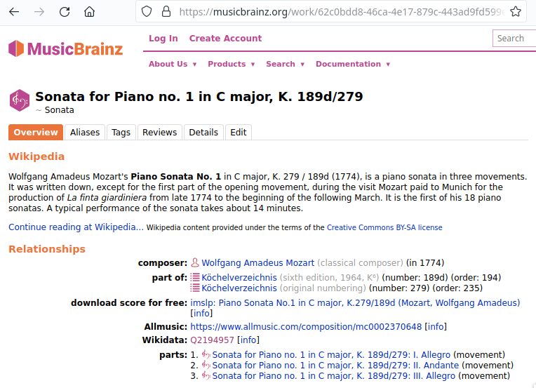
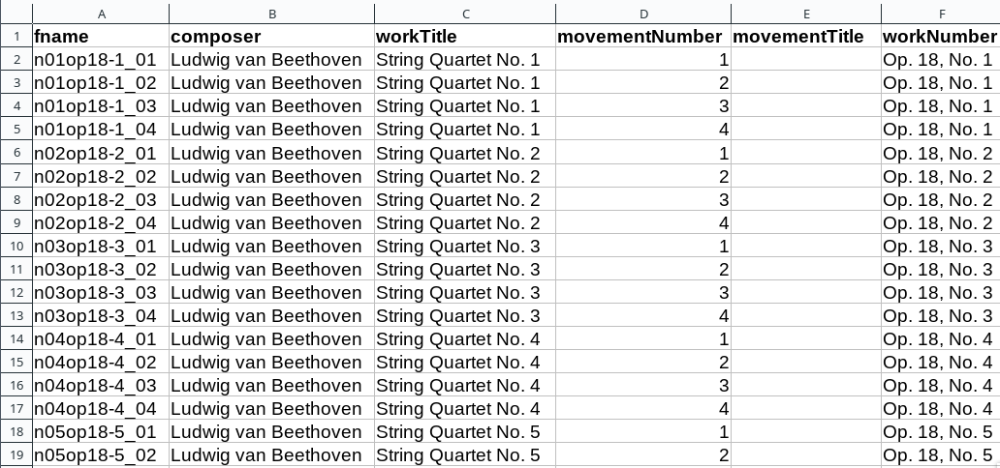
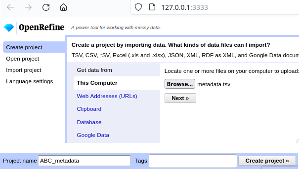
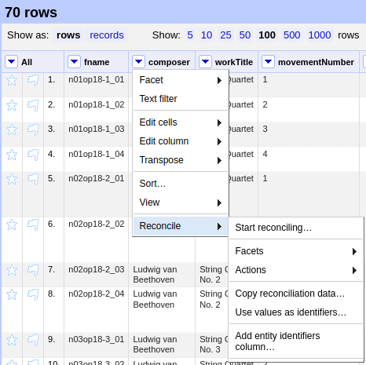
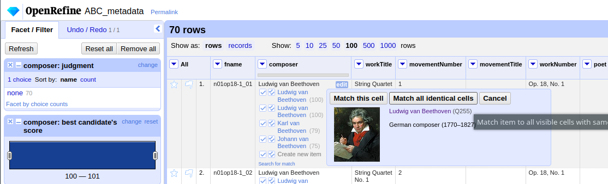
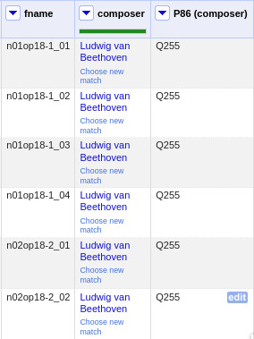
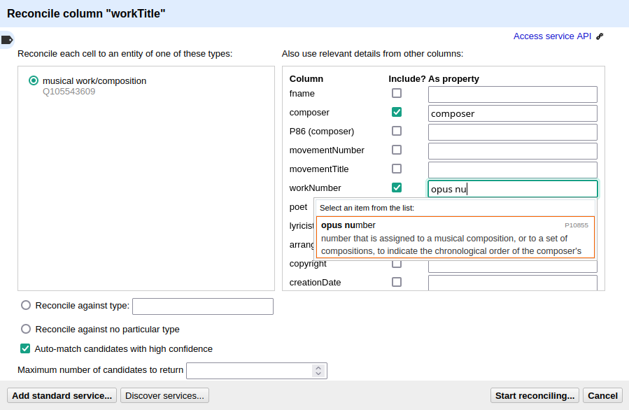
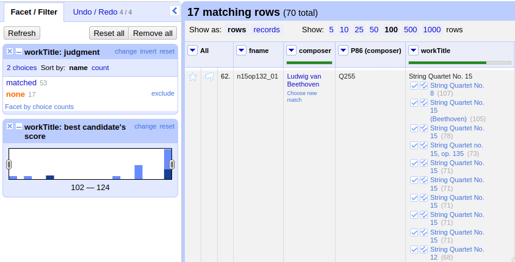
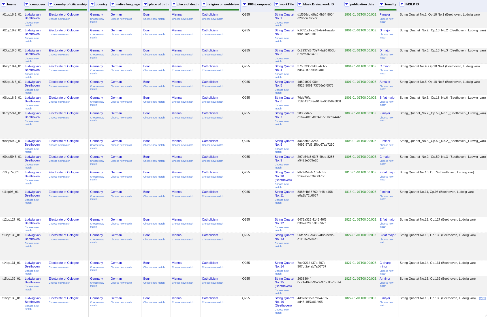

*****************************
DCML Corpus Creation Pipeline
*****************************

.. contents:: Contents
   :local:

.. _get_scores:

Collect and prepare the digital edition in the latest MuseScore format
======================================================================

Prior research
--------------

* Check which pieces make up the collection
* how they are grouped
* what naming or numbering conventions exist
* which editions there are
* if different versions of the pieces exist.
* Come up with a list (and hierarchy) of names. Here, you can already think of a good naming/numbering convention for the corpus.
* It might be good to create the list of the overarching group of works even if your corpus will contain only parts of it, for the sake of a better overview.
* Example: Going from the `list of Monteverdi's Madrigal books <http://www3.cpdl.org/wiki/index.php/Claudio_Monteverdi>`__
  to an `initial README file <https://github.com/DCMLab/monteverdi_madrigals/>`__.

Look up and check existing scores
---------------------------------

* All scores available need to be checked and compared:
    * reference edition
    * completeness
    * quality & errors
    * license (later publication!)
    * file format and expected conversion losses
* Where to check
    * First: musescore.com because the scores are in the target format
    * musicalion.com (not free to publish: need to ask first)
    * choral music: CPDL
    * http://kern.ccarh.org/ lossless humdrum 2 musescore conversion needed

Typeset non-existent files
--------------------------

* pick reference edition and send commission to transcriber
* depending on the music, prices may vary between 5 and 20 CHF per page

File curation
-------------

The scores need to be corrected on the basis of a reference edition/manuscript.
We have a collaborative document with detailed
`Score correction guidelines <https://docs.google.com/document/d/1Q2svEUSsE7OCetik8An__gsEwQCYNfFJlHFMF9dRce4/edit#heading=h.8hrcm7m3udll>`__.
It also stipulates which information from the reference edition/manuscript needs to be encoded in what way.
Please send a request to be added to the document.

* Convert to MuseScore format
    * XML, CAP: can be done with MuseScore's batch converter plugin or with ``ms3 convert``
    * CAPX: Conversion to CAP or XML with DCML's Capella license
    * MUSX: Conversion to XML with private Finale copy
    * SIB: Conversion to XML with Sibelius on DCML's iMac
    * LY: no good conversion available
    * KRN: hum2xml can be used but it would be preferable to have our own converter to MuseScore
    * results need to be checked; especially markup such as slurs, arpeggios, trills etc. often get screwed
* Renaming
    * Decide on naming convention and create a map (without extensions) from old to new filenames
    * Sometimes, files need to be split at that point because they contain several movements
        * For this, you introduce section breaks separating the movements
        * After every section break, you have to re-insert the time and key signature or add it into the split file
        * Start with the last movement, select it and do `File -> Save Selection`
        * Repeat for all movements
    * Rename the files
    * Possibly add a small script that automatically renames the source files
* Use parser/checking tool and/or manual checks for consistency
    * certain bars need to be excluded from the bar count:
        * anacrusis
        * pickup measures throughout the piece
        * second voltas (i.e. second repeats)
    * irregular measure lengths need to complete each other
        * e.g. when a repeated section starts with a pickup measure, the last measure of the repeated section needs to be shorter
        * anacrusis is substracted from the last bar
    * if in the reference edition the bar count restarts in the middle of the piece (e.g. in some variation movements), you can
        * either: split the movement into individual files (not preferable if you want to keep the movement as one coherent unit)
        * or: have two versions, one working version with continuous (unambiguous) measure numbers that depart from the reference edition, and one that is provided separately, that has the original (ambiguous) measure numbering but is not used for computational purposes. The reset of the counter should not be done via "add to measure count" using a negative number, but rather via section breaks.

Create metadata
---------------

All metadata fields are automatically extracted by the dcml_corpus_workflow and represented in the repository's
``metadata.tsv`` file. However, at the beginning this file needs to be created using the command ``ms3 extract -D -a``.
The first column, ``fname``, is used as IDs for the corpus and needs to be checked. In case the corpus contains
several alternative scores for the same piece, the main MuseScore file should have the shortest file name and the
alternative scores' file names should begin with the same ``fname`` plus a suffix or a different file extension.
Upon creation of the ``metadata.tsv`` file, all scores will be listed and you can safely remove the rows corresponding
to the alternative versions to prevent them being processed by ms3.

Once the ``metadata.tsv`` is there and contains one row per piece, metadata curation is as straightforward as
updating values and adding columns to the file and then calling
``ms3 metadata`` to write the updated values into the corresponding Musescore files. Be aware that calling
``ms3 extract -D`` will overwrite the manual changes in the TSV file with any value existing in the MuseScore files.
so make sure to commit your manual modifications to not loose them.

.. warning::

   Although many editors open TSV files, many of them silently change values, e.g. by removing
   ``.0`` from decimal values (LibreOffice) or turning a ``4/4`` time signature into a date (Excel,
   Numbers). One editor that doesn't to that is VScode. Make sure to **always** view the diff before
   committing changes to ``metadata.tsv`` to avoid unwanted modifications or, worse, loss of data.

Once the ``metadata.tsv`` is there and contains one row per piece, you can either continue with the following section
and create the new Git repository or :ref:`enrich the metadata <enriching_metadata>` first. Since enriching metadata
involves modifying the scores, however, it is preferable to make metadata curation part of the Git history.

.. _score_repo:

Creating a repository with unannotated MuseScore files
======================================================

.. danger:: After we start the annotation workflow, no MuseScore files should be added. removed, or renamed! The edition
   needs to be complete and the file names final.

Before starting annotating a corpus, a repo with the standard folder structure needs to be created: ::

  .
  ├── MS3
  └── pdf

The directory ``MS3`` contains the unannotated MuseScore files and ``PDF`` the print edition or manuscript which they
encode. In order to activate the annotation workflow (i.e. the automatic scripts triggered on the GitHub servers
by certain events related to annotation and review), the folder ``.github/workflows`` needs to be copied from
the `template repository <https://github.com/DCMLab/annotation_workflow_template>`__. It also contains our
standard ``.gitignore`` file which prevents temporary files from being tracked and uploaded.

Variant 1: Using the template repository
----------------------------------------

You can create the new repo directly from the `template repository <https://github.com/DCMLab/annotation_workflow_template>`__
by heading there and clicking on 'Use this template'. In this variant, every push to the ``main`` branch results
in metadata, measures and notes being extracted from all changed ``.mscx`` files. Note that renaming and deleting
files will lead to undesired effects that will have to be checked and corrected manually.

Variant 2: Starting from scratch
--------------------------------

Or you simply create the new repo with the above-mentioned folder structure and add the workflow scripts when
the scores are prepared. In this case, you will have to use the `Python library ms3 <https://pypi.org/project/ms3>`__
to extract metadata, notes, and measures manually.

Variant 3: Splitting an existing repository
-------------------------------------------

This is for the special case that the MuseScore files in question are already sitting in a subfolder of an existing
repository which is to be transferred into the new repo including the files' Git histories. This variant is a bit
more involved and requires prior installation of the `git filter-repo <https://github.com/newren/git-filter-repo>`__
command which is recommended by the Git developers for replacing ``git filter-branch``.

Setting
  As an example, we will create a new repository ``chopin_mazurkas`` (Repo B) which will include all files situated in the
  existing repository ``corpora`` (Repo A) in the subfolder ``annotations/Chopin-Mazurkas``, with the workflow scripts
  added on top.

Create the new repo B
  On GitHub, we use the `template repository <https://github.com/DCMLab/annotation_workflow_template>`__ to create
  the target repo ``chopin_mazurkas`` with the workflow files and the standard ``.gitignore``. Locally, we initialize
  an empty Git repo that will be connected upstream at a later point: ::

    mkdir chopin_mazurkas && cd chopin_mazurkas && git init

  Make sure that your Git is configured to use the name ``main`` for the default branch, which can be achieved using
  ``git config --global init.defaultBranch main``.

Clone repo A and transfer files
  We start off with a fresh clone of ``corpora``, head into it and run: ::

    git filter-repo --subdirectory-filter annotations/Chopin-Mazurkas/ --target ../chopin_mazurkas

  which will copy all files from ``annotations/Chopin-Mazurkas/`` to the freshly initialized repo
  ``chopin_mazurkas`` together with their full commit histories. If there is a README file, rename it to ``README.md``.

Connect local repo B to the remote repo B
  The local ``chopin_mazurkas`` now contains the files at the top level together with the full commit
  history (check out ``git log``). Now we can connect it to the remote and merge the workflow scripts from there: ::

    git remote add origin git@github.com:DCMLab/chopin_mazurkas.git
    git pull origin main --allow-unrelated-histories
    git push -u origin main

Clean metadata
  In case there was an older ``metadata.tsv`` it should now be automatically updated and you might have to clean it.
  This may involve naming the first two columns ``rel_paths`` and ``fnames``. For the Mazurka example,
  `this Pull Request <https://github.com/DCMLab/chopin_mazurkas/pull/1>`__ shows the metadata cleaning and update
  of the existing files from an older MuseScore and annotation standard.

Configuring and adding the new repo
===================================

* Set the standard repo settings on GitHub:

  .. figure:: img/pr_settings.png
       :alt: Repository settings on GitHub
       :scale: 50%

* Under ``Branches``, create a branch protection rule for the main branch:

  .. figure:: img/branch_protection.png
       :alt: Protecting the main branch on GitHub
       :scale: 50%

* Under ``Collaborators and teams`` give write access to the ``annotators`` team.
* Under ``Pages`` set the Source to the root ``/`` of the branch ``gh-pages`` (which should have been
  automatically created by the workflow when pushing the first MuseScore files). Add the page's URL as the
  repo's website.
* Add the new repo to the corresponding meta-repositories (at least to ``all_subcorpora``, see below).
* Add the new repo to the annotation workflow (drop-down menus, OpenProject, WebHooks etc.)

.. _metarepos:

Adding the repo to one or several meta-repos
--------------------------------------------

The individual subcorpora can be embedded as submodules in meta-repositories. These meta-repos are listed in the private
`meta_repositories <https://github.com/DCMLab/meta_repositories>`__ repo. Currently, the most important ones are:

1. `dcml_corpora <https://github.com/DCMLab/dcml_corpora>`__ for published corpora
2. `all_subcorpora <https://github.com/DCMLab/all_subcorpora>`__ (private) for all published and unpublished corpora.

To add the new repo, head into the meta-repo and do ::

  git submodule add -b main git@github.com:DCMLab/chopin_mazurkas.git

Just to be sure, update all submodules: ``git submodule update --remote`` and push the whole thing.

Creating work packages on OpenProject
-------------------------------------

#. Follow the instructions for `create_work_packages.py` under https://github.com/DCMLab/openproject_scripts/

   - set the column ``parent`` to the name of the repository
   - rename the columns ``fnames => name`` and ``last_mn => measures``
   - if the new work packages are for annotation upgrades rather than new annotations, add the column ``work_package_type``
     with value ``Annotation Upgrade``
   - find out the status of all pieces and fill the column ``status``. Accordingly:
   - if annotations are present and need to be updated, rename ``annotators => reviewer`` and make sure that every cell contains exactly one
     user name (``First Last``) known to OpenProject;
   - if review is done or ongoing, do the same for the renamed column ``reviewers => reviewer``
   - if annotations are present and finalized, the work package, in theory, does not need to be created; if it is,
     it should have status "Not available". Filling the fields ``assignee`` and ``reviewer``, is not needed unless for invoicing purposes

#. Create a new view in OpenProject:

   - open any of the existing corpora views
   - replace the ``Parent`` filter with the repo name
   - in the menu, select ``Save as...``
   - enter the repo name and check ``Public``

#. Add the webhook to the repo

   - go to a repo for which the webhook is already set up
   - in the repo settings, go to ``Webhooks``, click ``Edit``, and copy the ``Payload URL``
   - in the new repo, go to ``Settings -> Webhooks -> Add webhook`` and insert the copied ``Payload URL``
   - set the ``Content type`` to "application/json"
   - Below, select "Send me **everything**" and click ``Add webhook``

#. Add the new work packages to the master sheet for the administrative staff

.. _enriching_metadata:

Curating and enriching metadata
===============================

In MuseScore, metadata is stored as ``key -> value`` pairs and can be accessed and modified via the menu
``File -> Score Properties...``. Some fields are there by default, others have to be created using the ``New`` button.
It is very important that the fields are named correctly (double-check for spelling mistakes) and all lowercase.
The command ``ms3 extract -D`` extracts the metadata fields from the MuseScore files, updating the
``metadata.tsv`` file in a way that every row corresponds to a MuseScore file where every ``key`` is a column showing
the ``value`` from the corresponding file. Likewise, this can be used to batch-edit the metadata of several or all
MuseScore files in the corpus by editing the ``metadata.tsv`` file and calling the command ``ms3 metadata``.

.. warning::

   Before manipulating ``metadata.tsv`` make sure to call ``ms3 extract -D``, ensuring that it is up to date
   with the metadata contained in the MuseScore files. Otherwise the command ``ms3 metadata`` would overwrite
   newer values, resulting in the criminal offense of undoing other people's work.

DCML corpora usually come with one MuseScore file per movement, hence we follow the convention that anything related to
``work`` describes the whole group (Suite, Symphony, etc.) or cycle (e.g. song cycle), and fields containing
``movement`` or ``mvt`` its individual parts. It follows that in the ``metadata.tsv`` file titles, catalogue numbers,
URIs etc. are repeated and identical for the parts of a ``work``. Identifiers for individual movements are often
hard to come by, but musicbrainz has already a good number of them. For compositions where the subdivision into
parts is somewhat arbitrary (consider the grouping into tracks for recordings of the same opera), the question of
unique identification is an open problem.

.. note::

   Whereas in filenames we avoid all diacritical signs, accents, Umlaute etc., the metadata needs to include them
   accurately encoded in UTF-8. For example, write ``Antonín Dvořák``, not ``Antonin Dvorak``. Whenever in doubt,
   go with the English Wikidata/Wikipedia.

Default fields
--------------

The following default fields should be populated where applicable:

composer
  Full name as displayed in the English Wikipedia. For example,
  `Tchaikovsky <https://en.wikipedia.org/wiki/Pyotr_Ilyich_Tchaikovsky>`__ gets ``Pyotr Ilyich Tchaikovsky``.

workTitle
  Name of the entire work/cycle, e.g. ``Winterreise`` or ``Piano Sonata No. 1 in C major`` without any catalogue
  or opus numbers. The title should largely correspond to the English ``label`` of the corresponding (or future)
  Wikidata item.

workNumber
  This is where opus and catalogue numbers go, e.g. ``Op. 33, No. 3, BI 115-3``.

movementNumer
  Ordinal number of the movement or part. Should be an arabic integer, e.g. ``2`` (not ``2.``, not ``II``).

movementTitle
  Title of the part, e.g. song title, or ``Andante`` (not ``II. Andante``). If unclear, CD track titles might serve
  as an orientation.

source
  URL of the adapted digital edition, e.g. a link to musescore.com or kern.humdrum.org.

Required custom fields
----------------------

The following fields need to be populated.

.. _composition_year_columns:

composed_start, composed_end
  Each of these two fields needs to contain a 4-digit year number such that taken together they represent the time span
  during which the piece was composed according to ``composed_source``. If the time span lies within the same year,
  both fields contain the same number. If the source indicates an open interval (e.g. ``?-1789``), we use the
  `EDTF <https://www.loc.gov/standards/datetime/>`__ convention to indicate the unknown date (here ``composed_start``)
  as ``..``. If no composition date is known, we use the following dates as fallback, in that order:

  #. year of the princeps edition
  #. musicologically informed time span (e.g. the composer's "sad phase" from x-y)
  #. composer's life span

  In any of these cases, an explaining comment should be added to the ``composed_source`` field.

composed_source
  The reference to where the ``composed_start`` and ``composed_end`` dates come from. Could be a URL such as
  `<https://en.wikipedia.org/wiki/List_of_compositions_by_Edvard_Grieg>`__, the name of a dictionary or work catalogue,
  or bibliographical data of a book. The latter would be required in the case of using a "musicologically informed
  time span" (see above). This field is free text and, in the absence of composition dates, should contain additional
  information on what exactly the years represent, e.g.
  ``dates represent the "late period" of composer X's work, as proposed by author Y in book Z, page n``.

Identifiers where available
---------------------------

Identifiers are important for making data findable and interoperable but might not always be available. Nevertheless,
the goal should be to find minimum one of the work or part-of-work identifiers listed below. Wikidata identifiers
are the gold standard because they often come with a mapping to all other kinds of identifiers. In addition,
Wikidata is a knowledge graph which lets us easily pull additional metadata. The site has the drawback
that identifiers for less known works are mostly missing as of yet and so are identifiers for individual movements.
Until the fundamental problem of community-wide work identifiers is solved, we should aim at completing missing
Wikidata items and foster the graph's function as a Linked Open Data hub and registry for all other sorts of
identifiers.

wikidata
  This field is used to identify the ``work`` with the full URL of its corresponding Wikidata item, e.g.
  `<http://www.wikidata.org/entity/Q2194957>`__. If the ``composer`` and ``workTitle`` field are properly filled in,
  they can be reconciled with, i.e. matched to,
  Wikidata `using OpenRefine <https://openrefine.org/docs/manual/reconciling>`__.

musicbrainz
  musicbrainz.org has a whole lot of different identifiers, in particular for identifying individual recordings down
  to the level of CD tracks. The ones we're interested here are work identifiers (make sure the URI starts with
  ``https://musicbrainz.org/work/``). The project is very advanced with creating identifiers on the
  sub-work (movement) level and we use those whenever available (see screenshot below).
  If not, we repeat the the work ID for each movement.

   Example of a work displayed on musicbrainz (note the URL). In this case, it lists identifiers for its three
   movements so we would be using these.

viaf
  Work URI, e.g. `<https://viaf.org/viaf/181040674>`__

imslp
  URL of the work's Wiki page, e.g.
  `<https://imslp.org/wiki/Piano_Sonata_No.1_in_C_major%2C_K.279/189d_%28Mozart%2C_Wolfgang_Amadeus%29>`__

pdf
  We use this field, if applicable and available, to store the permanent link to the source PDF which the
  digital score is supposed to represent. Most often this will be an IMSLP "permlink" pointing to a particular
  edition through its ID, such as `<https://imslp.org/wiki/Special:ReverseLookup/1689>`__ (the corresponding PDF file
  name starts with ``IMSLP01689``). Such a permlink is available via the edition's menu, by clicking on
  ``File permlink``.

P<number> (<description>)
  Columns with a Wikidata "P-number" are used for storing a reconciliation with the Wikidata knowledge graph. For
  example, the column ``P86 (composer)`` contains both the ID of the
  `property 'composer' <https://www.wikidata.org/wiki/Property:P86>`__ and in parenthesis the English label of the
  property. The values of the column are the "Q-numbers" of the composer item. For more information, refer to
  :ref:`reconciling` below.

Contributors and annotations
----------------------------

Custom fields to give credit to contributors and to keep track of versions of annotation standards and the likes.
The preferred identifiers for persons are ORCIDs such as ``0000-0002-1986-9545`` or given as URL, such as
`<https://orcid.org/0000-0002-1986-9545>`__.

typesetter
  Name/identifier/homepage of the person(s) or company who engraved the digital edition or major parts of it.

score_integrity
  Name/identifier/homepage of the person(s) or company who reviewed and corrected the score to make it
  match the reference edition/manuscript (potentially referenced under ``pdf``).

annotators
  Name/identifier of each person who contributed new labels. If the file contains several types/versions/iterations,
  specify in parenthesis who did what.

reviewers
  Name/identifier of each person who reviewed annotation labels, potentially modifying them.
  If a review pertained only to a particular type/version/iteration, specify in parenthesis which one.

harmony_version
  Version of the DCML harmony annotation standard used, e.g. ``2.3.0``.

.. _reconciling:

Reconciling metadata with Wikidata
----------------------------------

Wikidata is a knowledge graph in which

* each node (a noun considered as subject or object of a relation) is identified by a "Q-number" such as ``Q636399``
  (`the song "Smoke on the Water" <https://www.wikidata.org/wiki/Q636399>`__),
* each edge (a verb or property) by a "P-number" such as ``P921``
  (`the property "main subject" <https://www.wikidata.org/wiki/Property:P921>`__, in this example pointing to the node
  `Q81085137 <https://www.wikidata.org/wiki/Q81085137>`__).

Reconciling metadata with Wikidata means linking values to nodes in the graph by assigning the relevant Q-numbers,
which can be comfortably achieved with the software ``OpenRefine <https://openrefine.org/>``. As an example,
we take the insufficiently populated ``metadata.tsv`` from the Annotated Beethoven Corpus version 2.1
(`link <https://raw.githubusercontent.com/DCMLab/ABC/v2.1/metadata.tsv>`__).
The goal of this step-by-step guide is to reconcile the composer and his 16 string quartets with Wikidata.

Creating a new OpenRefine project
^^^^^^^^^^^^^^^^^^^^^^^^^^^^^^^^^

As a first step, we need to make sure
that our metadata table contains values that OpenRefine can reconcile with Wikidata's node labels. Here, we can
use the file names and some regular expression magic to fill the columns:

   ABC metadata.tsv with populated ``composer``, ``workTitle``, ``movementNumber``, and ``workNumber`` columns.

Next, we load the file into OpenRefine, click on ``Next »``, check the preview, adapt the setting for loading the
TSV file if needed (usually it isn't), name the project and click on ``Create project »``.

   Creating a project by loading the ``metadata.tsv`` file into OpenRefine.

Reconciling a column
^^^^^^^^^^^^^^^^^^^^

Now we can start reconciling the values of a column by opening it's menu ``Reconcile -> Start reconciling...``.

   Opening the reconciliation pane in OpenRefine.

The upcoming pane has a list of services on the left side that should include at least ``Wikidata (en)``, which is
what we click on. OpenRefine tries to guess the item type that the values could be matched with and correctly suggests
``Q5 (human)``. Since the correct type Q5 is already selected we can go ahead with ``Start reconciling...``. Once
the process is complete, a new facet appears on the left side that lets us view the different types of match results.
In this example, all 70 movements have type ``none`` and we need to pick the correct item that corresponds to the
composer in question.

   Selecting the corresponding Wikidata item to automatically assign it to all cells.

Sometimes, OpenRefine does not suggest any item. In this case, supposing an item does indeed exist, we can go to
the column's menu ``Reconcile -> Actions -> Match all filtered cells to...`` and manually search for the item.

Once everything has been correctly matched, we can automatically create a new column to store the Q-numbers.
This is as easy as accessing the column menu ``Reconcile -> Add entity identifiers column...``. When asked for the
new column name, we use the
`QuickStatements CSV logic <https://www.wikidata.org/wiki/Help:QuickStatements#CSV_file_syntax>`__ which boils down to
thinking of each row as the subject of a ``(subject, verb, object)`` triple, and storing ``object`` Q-numbers in
``verb`` columns. In this example, we are storing Q-numbers that correspond to the pieces'
`'composer' property <https://www.wikidata.org/wiki/Property:P86>`__ and therefore we name the new column
``P86 (composer)``:

   Metadata table with the newly created column ``P86 (composer)`` pointing to the matched Q-number(s).

The result can now easily written back to the original file using the menu ``Export -> Tab-separated value`` in order
to then insert the new values into the MuseScore files. Please make sure to check the diff of the updated
``metadata.tsv`` before committing to prevent committing unwanted changes or, even worse, having them written
into the scores.

Reconciling the ``workTitle`` column
^^^^^^^^^^^^^^^^^^^^^^^^^^^^^^^^^^^^

Many Wikidata items can be expected to bear labels such as ``String Quartet No. 1`` and therefore there is quite some
ambiguity involved in matching. Since we have already reconciled the ``composer`` column, we can use it to constrain
the reconciliation of the ``workTitle`` column to pieces that have been composed by Beethoven.

To achieve that, we bring up the reconciliation pane and, once more, OpenRefine correctly infers the type of the
items that we are trying to match, ``Q105543609 (musical work/composition)``. On the right side, we assign the
property ``P86 (composer)`` to the ``composer`` column by typing ``composer`` and selecting the correct property.

   Matching the workTitle column constraint by the reconciled composer column.

In this case, we can try to additionally use the ``workNumber`` column. This makes sense without prior reconciliation
because the corresponding property ``P10855 (opus number)`` has a literal data type, string. In other words,
Wikidata users populate this property with free text rather than with a Q-number. We cannot be sure that the property
is present at all and, if it is, whether the strings follow a consistent format. Another source of inconsistency
could be a confusion with ``P528 (catalog code)``,
`as discussed here <https://www.wikidata.org/wiki/Wikidata:Property_proposal/opus_number#%7B%7Bint%3ATalk%7D%7D>`__.
In an ideal world we would not only consume metadata from the knowledge graph but also help cleaning it up for our
domain.....

   Matching Beethoven string quartets with the correct Wikidata items.

The screenshot shows that 53 were matched automatically and 17 are ambiguous. In theory we could automatically
match them based on their match score but, as we can see, this would wrongly match our ``String Quartet No. 15``
with the item ``Q270886 (String Quartet No. 8)``, meaning we need to go through the works and select the right match
carefully. However, once we have matched No. 15 with the correct item and see that for the other ambiguous pieces
the correct items have the highest match score respectively, we can use the
``Reconcile -> Actions -> Match each cell to its best candidate`` shortcut to finalize the task.

.. note::

   In the name of thoroughness, we also need to take a look at the automatically matched items to avoid
   false positives.

Pulling additional information
^^^^^^^^^^^^^^^^^^^^^^^^^^^^^^

Obviously, with all cells having the same composer value we would have been faster to create the ``P86 (composer)``
column manually, filling in the value ``Q255`` for all cells. But using
OpenRefine gives us the advantage that, once reconciled, we can pull additional information on the composer item
from the Wikidata knowledge graph. For that we simply access the matched composer column's menu
``Edit column -> Add columns from reconciled values`` which will lead us to a list of properties that we can simply
click on to create additional columns. For example, we can easily add columns called
"country of citizenship", "native language", "place of birth", "place of death" and "religion or worldview".

This step can be repeated for the added columns. The screenshot shows the column ``country`` that was created by
pulling the property ``P17 (country)`` for the ``Electorate of Cologne`` items. In addition the columns
``MusicBrainz work ID``, ``publication date``, ``tonality``, and ``IMSLP ID`` have been created from the
reconciled work IDs.

   Additional columns pulled from the Wikidata knowledge graph based on the reconciled composer items;
   displayed for the 16 first movements.

After exporting the newly gained values to our original ``metadata.tsv``, we can process them further, for example,

* by turning the publication dates that come in ISO format into our default
  :ref:`composition year columns <composition_year_columns>` which contain only a year number;
* by integrating the values in the ``tonality`` column into the ``workTitle`` column (to get something along the lines
  of ``String Quartet No. 1 in F major``, for example);
* by renaming the column ``IMSLP ID`` to its default name ``imslp``;
* by using the column ``MusicBrainz work ID`` for automatically retrieving IDs for the individual movements for our
  default column ``musicbrainz``; as well as values for the column ``movementTitle``, for example.

Future work: Sub-work-level items
^^^^^^^^^^^^^^^^^^^^^^^^^^^^^^^^^

Wikidata has a simple mechanism for linking a work to its parts, such as movements. Consider for example the item
for Joseph Haydn's Trumpet Concerto in E-flat major, Hob. VIIe:1, `Q1585960 <https://www.wikidata.org/wiki/Q1585960>`__.
The property ``P527 (has part(s))`` links it to the three items that represent its three movements, each of which is
linked to its parent item via ``P361 (part of)``. The problem is that in the majority of cases, such sub-work-level
items do not exist yet. MusicBrainz work IDs, on the other hand, are often available (because they are required
to identify CD tracks). Once we have reconciled our scores representing individual movements with Wikidata work IDs,
it would be actually a small step to go ahead and create items for the movements automatically via OpenRefine.
We should consider doing this at least for the cases where sub-work-level IDs are already available on
MusicBrainz. We could also consider to link the items to our scores in one go.
