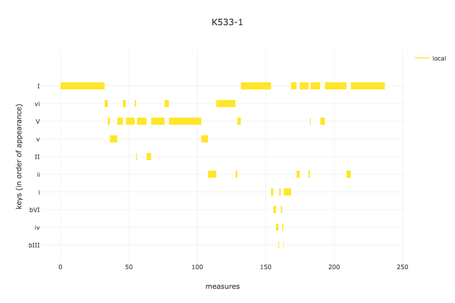
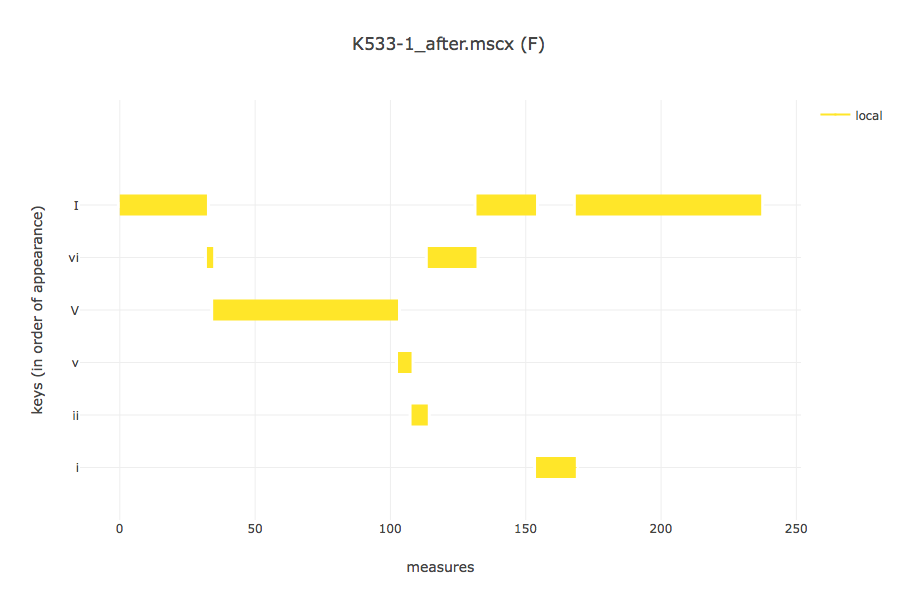
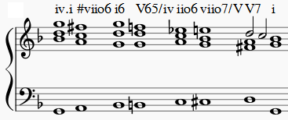
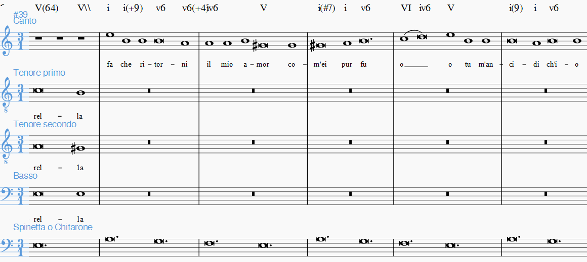
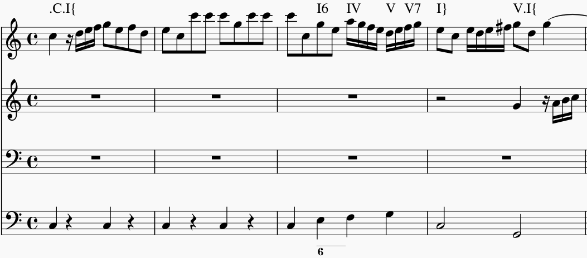
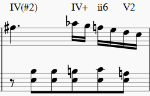
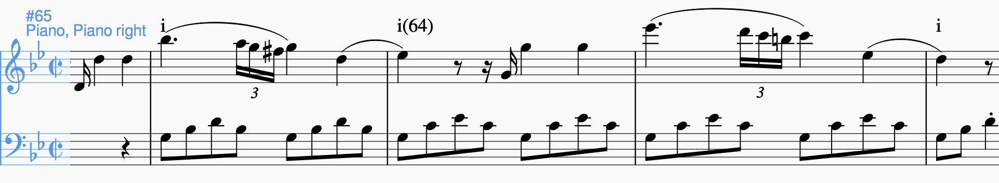
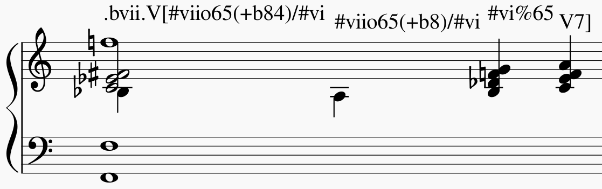

********************
Annotation Reference
********************

Introduction
============

Thank you for your interest in the DCML harmony annotation standard. Harmonic
analysis is a notoriously complex task, as of now very difficult to
teach to a computer. Therefore, we need to rely on hand-annotated
data when analyzing the development of tonal harmony over the last
five centuries with quantitative methods. With this goal in mind, we
have devised an annotation standard for encoding harmonic analyses in a
machine-readable format. This document serves as a reference for looking
up aspects of its syntax together with some examples. If you want to learn how DCML
annotators use MuseScore to enter harmonic analysis directly into
digital scores, please refer to our :doc:`annotation tutorial <../tutorial/index>`.

What is it?
-----------

In its essence, the standard consists of two things: A set of rules
for constructing chord labels in a standardized way and this reference
on how to apply these labels to music and how to interpret those that
you encounter. In this context, we use the words 'symbols', 'chord
symbols', 'labels', 'expressions', and 'annotations' interchangeably.
Generally you encounter them in two different contexts: Either
when you open a digital score in the XML format of the open-source
notation software `MuseScore 3.6.2 <https://github.com/musescore/MuseScore/releases/tag/v3.6.2>`__,
or in the form of an annotation table, that is a table in which
each row represents a label and each column one of its properties
such as position in the score, the key it occurs in, the chord
tones it represents, and its different features. This reference is
mainly concerned with explaining what these different properties are.

About this reference
--------------------

Everyone is free to use the proposed standard for encoding harmonic analyses
in ways, contexts, and environments of their free choice. The goal of this reference
is not to tell anyone how they should analyse harmony. Instead, its purpose
is to clarify what the different parts of the syntax are supposed to express
in order to allow analysts to communicate their musical interpretations in
a precise and consistent manner. The examples and recommendations are supposed to
be guidelines that have as a goal to make annotations from different users
comparable and interoperable.

General principles
------------------

The following principles are essential for producing correct annotations:

-  Chord symbols (i.e. Roman numerals) are attached to the moment in the
   score where the respective harmony begins. They are valid until the
   next symbol; identical symbols are never repeated consecutively
   (see :ref:`repetition-of-labels` for exceptions).
-  Symbols are typically attached to the lower system of the score, even if it
   contains only rests, at the precise position where the harmony occurs.
-  Arabic numbers indicating :ref:`inversions <roman-numerals>` or
   :ref:`chord tone changes <suspensions-and-retardations>` always appear
   in descending order (e.g. ``65`` or ``9#74``).
-  The information about a harmony is expressed in a fixed order
   (syntax) and orthographical errors can be automatically detected.
-  The annotations always need to represent a consistent reading, also in the
   case of repetitions, first and second endings, dal segnos, etc.
-  Major keys are indicated by uppercase, minor keys by lowercase letters.
-  We annotate non-chord tones such as suspensions, retardations, and additions,
   but not ornaments (neighbour notes, passing notes, embellishments).
   See :doc:`Level of detail <../tutorial/detail>` in the tutorial for guidance.
-  Before annotating, decide on the harmonic pace for the piece and maintain it
   consistently.
-  **Consistency** is the annotation standard's highest maxim: While different
   annotators would interpret the same music differently, it is important
   that the same annotator interprets the same music identically.

.. note::

   Depending on the source of the notation file you receive for annotation,
   it may be advisable to have a scan of the *Urtext* open for tacit correction
   of the score. At least the bar numbers must be 100% correct. Make sure that
   upbeat measures are counted by MuseScore as measure 0.

The syntax
==========

Every chord symbol *must* have at least one compulsory Roman numeral and *may*
start with an indication of key, followed by a separating dot. Such an
indication sets the context for the attached Roman
numeral *and* for all subsequent symbols up to the next indication of
key. Phrase annotations represent a separate standard. Therefore they can
stand alone, without a chord label, or at the very end of one.

Indication of key
-----------------

-  The first symbol written in a score always starts with the absolute
   indication of the entire piece's tonality.
-  Simply type the tonic's note name {A/a,B/b,C/c,D/d,E/e,F/f,G/g(#/b)}
   followed by a dot. Examples: ``f#.i`` for the first harmony of
   a piece in F sharp minor; ``Ab.I`` for the first harmony of a piece
   in A flat major; both pieces beginning with the tonic harmony.
-  All other indications of key (i.e. 'local keys') are entered as Roman
   numerals relative to that.
-  Example 1: As soon as a piece in C major modulates to G major, you
   can indicate the new key by typing ``V.I`` over the harmony of G
   major. All subsequent Roman numerals up to the next indication of key
   relate to the new key of G major.
-  There is a way of annotating secondary dominants (see
   :ref:`relative-key`); however, if you find a ``V/vi`` chord and
   the music then stays in the key of ``vi`` for a longer time (cf. next
   paragraph), you can write ``vi.V`` right away. Every following ``i``
   symbol designates the new tonic.

Example
^^^^^^^

``I6 ii65/V V7/V V`` and ``I6 V.ii65 V7 I`` (from the Schumann example
below), in general, express the same chords but a preference has to be
given either to the first version - i.e., with **applied chords** - or
to the second - i.e., with change of **local key**. In principle, it is
an objective of your analyses to include a bigger picture of a piece's
tonality through exactly this kind of choices. This means that upon
making such a choice, you need to include the broader context:

* If the
  example passage is a mere tonicization of ``V`` followed by a return to
  the original tonic, that is a case for the version with applied chords
  because the local key stays the same. This is the case in the given
  example. (**NB** ``I/V`` has exactly the same meaning as ``V``
  and, at the end of an authentic cadence should should be the preferred
  solution.)
* If, on the other hand, the music
  continues in the key of V, the second option should be chosen. The
  general rule is that, in such a modulation, the change of local key
  should be annotated

  * at the latest when a chord cannot be interpreted in the old, but in
    the new key (i.e., where the A# occurs);
  * as early as consistently possible;
    so, depending on the context you could even write ``V.IV6 ii65 V7 I``.

.. note::

     Note that the key indications of applied chords always relate to the
     local key (see the following section). So, if the Schumann example
     below was not in E major but in A major instead, the same harmonic
     progression would be standing in the key of V:
     ``V.I6 ii65/V V7/V I(4)/V`` with the **applied notation**
     remaining unchanged (``/V``) because it is **relative** to the local
     key; whereas the **change of local key** would indicate the
     *absolute* key instead: ``V.I6 II.ii65 V7 I(4)``

+------------------------+---------------------------------+
| Approriate annotation  | Unappropriate annotation        |
+========================+=================================+
| |localkeycorrect|      | |localkeywrong|                 |
+------------------------+---------------------------------+
| *mm. 4-5 from Schumann's "Wehmut", Liederkreis op. 39/9* |
+------------------------+---------------------------------+

The rationale behind this logic can be seen in these automated key
analyses of two different annotations of the same piece:

+--------------------------------------+---------------------------------------+
| With too many changes of local key   | After correction to relative keys     |
+======================================+=======================================+
| |ganttbefore|                        | |ganttafter|                          |
+--------------------------------------+---------------------------------------+
| *Gantt chart showing the local keys in the first movement of Mozart's K. 533*|
+--------------------------------------+---------------------------------------+

.. _relative-key:

Relative key
------------

If a symbol relates to a different key than the one you are in, you can
indicate the relative key using a slash ``/``. Most prominently this is
the case for secondary dominants such as ``V65/IV``. The relative key is
indicated as relative to the local key and does not change the local
key.

Example: ``iv.i #viio6 i6 V65/iv iv viio7/V V7 i`` designates a cadence
in the key of ``iv`` (here: G minor) because of the initial indication of
key. Note that

* the relative keys ``iv`` (C minor) and ``V`` (D major) relate to the
  *local* key ``iv`` and not to the *global* (tonic) key (here: D minor);
* ``viio7/V`` is not spelled ``#viio7/V`` although the bass is altered.
  The reason is that it is the natural 7th scale degree in the key of
  ``V`` (D **major**). B flat, of course, is not natural in D major but
  is clearly annotated through the choice of ``viio7`` rather than
  ``vii%7``;
* combining relative key with a modulation can be counterintuitive
  because relative keys relate to the *local* key, whereas
  key indications used for modulation always relate to the *global* key.
  To avoid confusion, don't use relative key annotation if a modulation to
  that same relative key follows.

Relative keys of relative keys can be annotated, for example the
dominant-seventh harmony of the dominant key of the key of scale degree `v`: ``viio/V/v``.

.. admonition:: Common mistake
   :class: danger

   Since the root of ``viio/V`` has an accidental, novice annotators are
   often tempted to write ``#viio/V``. This is incorrect because the leading
   tone is scale degree ``7`` (not ``#7``) in major. These are all correct:
   ``I.viio/V``, ``i.viio/V``, ``I.#viio/v``, ``i.#viio/v``.

.. _roman-numerals:

Roman numerals
--------------

The smallest possible symbols consist of a single Roman numeral. They
stand for a major (``I, II, III, IV, V, VI, VII``) or minor
(``i, ii, iii, iv, v, vi, vii``) triad in root position. *All other
chords* --- those which are not a major or minor root-position triad on one
of the key's natural degrees --- need additional symbols. For altered
scale degrees, prefix the numeral with ``b`` or ``#``, e.g. ``bVI`` for
an Ab major chord in the context of C major, or ``#vi`` for an A minor
chord in the context of C minor.

.. note::

   Dorian and phrygian modes are annotated as minor keys; lydian and
   mixolydian as major. The root distances of ``iii III vi VI vii VII``
   from the tonic are major intervals in major keys and minor intervals
   in minor keys. See :doc:`The first label <../tutorial/first_label>` in
   the tutorial for details on modes.

.. note::

   You always indicate the chord type *before* the inversion.

Triads
^^^^^^

.. table:: Triads. <NA> = empty; RN = uppercase numeral; rn = lowercase numeral
   :width: 70 %
   :widths: auto
   :align: center

   +------+------+--------------+-------------------------+---------------------------------+
   | Root | Type | Inversions   | Chord type              | Examples                        |
   +======+======+==============+=========================+=================================+
   | RN   | <NA> | <NA>, 6, 64  | Major triad             | ``I``, ``V6``, ``IV64``         |
   +------+------+--------------+-------------------------+---------------------------------+
   | rn   | <NA> | <NA>, 6, 64  | Minor triad             | ``vi``, ``ii6``, ``iv64``       |
   +------+------+--------------+-------------------------+---------------------------------+
   | rn   | o    | <NA>, 6, 64  | Diminished triad        | ``viio``, ``iio6``, ``#ivo64``  |
   +------+------+--------------+-------------------------+---------------------------------+
   | RN   | \+   | <NA>, 6, 64  | Augmented triad         | ``III+``, ``III+6``, ``III+64`` |
   +------+------+--------------+-------------------------+---------------------------------+

Tetrads
^^^^^^^

Every seventh chord is distinguished by its type and one of the inversions
``7`` (root position), ``65``, ``43``, or ``2``.

.. admonition:: Mnemonic Hook
   :class: caution

   Arabic numbers always occur in descending order.

.. table:: Seventh chords. <NA> = empty; RN = uppercase numeral; rn = lowercase numeral
   :width: 75 %
   :widths: auto
   :align: center

   +------+------+--------------+-------------------------+-----------------------+
   | Root | Type | Inversions   | Chord type              | Examples              |
   +======+======+==============+=========================+=======================+
   | RN   | <NA> | 7, 65, 43, 2 | Dominant seventh        | ``V7``, ``IV65``      |
   +------+------+--------------+-------------------------+-----------------------+
   | rn   | <NA> | 7, 65, 43, 2 | Minor seventh           | ``vi7``, ``ii43``     |
   +------+------+--------------+-------------------------+-----------------------+
   | rn   | o    | 7, 65, 43, 2 | Diminished seventh      | ``vio7``, ``#viio2``  |
   +------+------+--------------+-------------------------+-----------------------+
   | RN   | \+   | 7, 65, 43, 2 | Augmented minor seventh | ``V+7``               |
   +------+------+--------------+-------------------------+-----------------------+
   | rn   | \%   | 7, 65, 43, 2 | Half-diminished seventh | ``vii%7``, ``#vi%43`` |
   +------+------+--------------+-------------------------+-----------------------+
   | RN   | M    | 7, 65, 43, 2 | Major seventh           | ``IVM7``, ``IIIM65``  |
   +------+------+--------------+-------------------------+-----------------------+
   | rn   | M    | 7, 65, 43, 2 | Minor major seventh     | ``iiiM7``             |
   +------+------+--------------+-------------------------+-----------------------+
   | RN   | +M   | 7, 65, 43, 2 | Augmented major seventh | ``I+M7``              |
   +------+------+--------------+-------------------------+-----------------------+

.. note::

   The inversion ``42`` is accepted as equivalent to ``2`` but ``2`` is the
   canonical form and should be preferred.

.. note::

   While a dominant seventh chord theoretically can appear on degrees other than
   V (e.g. ``VII7`` in a falling fifths progression), when the respective tonic
   follows, it should be annotated as a secondary dominant instead (e.g.
   ``V7/III``). However, there are cases where the same sonority occurs as
   ``IV7`` or ``IV65`` in a minor key, which is not notated as a dominant.

.. _augmented-sixth-chords:

Augmented sixth chords
^^^^^^^^^^^^^^^^^^^^^^

The standard provides special symbols for the three augmented sixth chords:

.. table:: Augmented sixth chords
   :widths: auto
   :align: center

   +---------+-------------------+---------+--------------------+
   | Symbol  | Name              | Root    | Equivalent         |
   +=========+===================+=========+====================+
   | ``It6`` | Italian sixth     | vii/V   | ``viio6(b3)/V``    |
   +---------+-------------------+---------+--------------------+
   | ``Ger6``| German sixth      | vii/V   | ``viio65(b3)/V``   |
   +---------+-------------------+---------+--------------------+
   | ``Fr6`` | French sixth      | V/V     | ``V43(b5)/V``      |
   +---------+-------------------+---------+--------------------+

The forms with their standard figured bass (``It6``, ``Ger6``/``Ger65``,
``Fr6``/``Fr43``) all express the chord in its standard position (with scale
degree ``b6`` in the bass) and are therefore equivalent. Other figured-bass
values indicate inversions: e.g. ``Ger7`` has ``#4`` in the bass, and ``Fr7``
has scale degree ``2`` in the bass. Since ``It6`` is a triad, ``It`` (without
figured bass) translates to its root position ``viio(b3)/V``.

.. note::

   In older versions of the standard, annotations were entered in MuseScore's
   Harmony layer rather than the Roman numeral layer. In that context, a leading
   dot was required to prevent MuseScore from interpreting note names as chord
   symbols (e.g. ``.Ger`` instead of ``Ger6``). This leading dot is
   **deprecated** and should no longer be used.

.. _suspensions-and-retardations:

Suspensions and retardations
----------------------------

Suspensions, retardations, and other chord tone changes are annotated as
Arabic numbers within round parentheses ``()`` following the Roman numeral,
form, and inversion. The numbers designate the note's interval **to the root**.
This is independent of the chord's inversion: the suspension ``(4)`` means the
same thing in ``V(4)``, ``V6(4)``, ``V65(4)``, ``V43(4)``, and ``V2(4)``
(in two of them, the suspension is in the bass).

To indicate the resolution, write the sounding chord without the change,
e.g. ``V(4) V7`` or ``V65(4) V65``.

.. note::

   The intervals designated by the Arabic numbers in parentheses are diatonic
   and depend on the chord's position in the scale and the scale itself.
   For example, ``iv(4)`` translates to ``F B C`` in a C major context but to
   ``F Bb C`` in a C minor context. Use ``b`` or ``#`` to alter:
   ``iv(b4)`` in C major yields ``F Bb C``.

Replacement from above (suspensions)
^^^^^^^^^^^^^^^^^^^^^^^^^^^^^^^^^^^^^

The digits ``2``, ``4``, ``6`` designate the upper neighbours of chord tones
``1`` (root), ``3`` (third), ``5`` (fifth) respectively. The replaced chord
tone is **not present**:

- ``(2)``: replaces the root
- ``(4)``: replaces the third
- ``(6)``: replaces the fifth

.. admonition:: Cadential six-four
   :class: caution

   The cadential six-four chord is written as ``V(64)`` to distinguish it from
   a passing ``I64``.

Replacement from below (retardations)
^^^^^^^^^^^^^^^^^^^^^^^^^^^^^^^^^^^^^^

A retardation resolves upward. The digit ``7`` designates replacement of the
root from below:

- ``(7)``: retardation of the root (resolution goes upwards)
- ``(#2)``: retardation of the third from below
- ``(#4)``: retardation of the fifth from below
- ``(#6)``: retardation of the seventh from below

Direction markers
^^^^^^^^^^^^^^^^^

When a digit has an accidental, the direction of replacement is inferred
by default:

- ``b`` before a digit implies suspension (replacement from above)
- ``#`` before a digit implies retardation (replacement from below)

Two explicit direction markers can override these defaults:

- ``v`` (from above): forces the digit to replace the chord tone below it.
  Needed for raised suspensions, e.g. ``v#2`` = sharped upper neighbour
  replacing the root.
- ``^`` (from below): forces the digit to replace the chord tone above it.
  Needed for unraised retardations, e.g. ``^2`` = diatonic 2 replacing the
  third.

The complete set of replacement combinations:

- From above (replacing ``1``, ``3``, ``5``): ``2``, ``b2``, ``v#2``,
  ``4``, ``b4``, ``v#4``, ``6``, ``b6``, ``v#6``
- From below (replacing ``3``, ``5``, ``7``): ``^2``, ``^b2``, ``#2``,
  ``^4``, ``^b4``, ``#4``, ``^6``, ``^b6``, ``#6``

.. note::

   Remember that the accidentals ``b`` and ``#`` depend on the local major or
   (natural) minor scale.

Replacement of octave doublings
^^^^^^^^^^^^^^^^^^^^^^^^^^^^^^^^

The digits ``9``, ``11``, ``13`` are used when the chord tone is present but
replaced in one of the upper octaves:

- ``(9)``: replaces an octave doubling of the root (root **present**);
  contrast with ``(2)`` where the root is **not present**
- ``(11)``: replaces an octave doubling of the third (third **present**,
  often in a lower voice or in the bass)
- ``(13)``: replaces an octave doubling of the fifth (fifth **present**)

For example, the "Chopin chord" (dominant seventh add 13) is expressed
as ``V7(13)`` to clarify that the fifth is present and the added note is
(at least) a ninth apart. The distinction matters for added notes too:
``V7(+6)`` (dissonance is a second) vs. ``V7(+13)`` (dissonance is a ninth).

Ninth chords
^^^^^^^^^^^^^

Dominant ninth chords illustrate the interplay of these conventions:

* ``V7(9)``, ``V7(b9)``, ``V7(v#9)``: ninth replaces an octave doubling
  of the root
* ``V7(^9)``, ``V7(^b9)``, ``V7(#9)``: ninth replaces an octave doubling
  of the third
* ``V7(+9)``, ``V7(+b9)``, ``V7(+#9)``: ninth is an added note

.. _root-replacement:

Replacement of the root by its lower neighbour
^^^^^^^^^^^^^^^^^^^^^^^^^^^^^^^^^^^^^^^^^^^^^^^^

Following the above logic, replacement of the lowest root (``1``) in the chord
should be expressed through ``0`` or ``#0`` (leading tone in a minor scale).
However, for convenience, ``7`` or ``#7`` are commonly used instead (which
logically express replacement of an octave doubling of the root). Therefore
``0`` and ``7`` are equivalent in nearly all cases. The exception is
root-position chords, where the root is in the bass: Here, ``0`` is required
to differentiate from replacement of an octave doubling (``7``).

Multiple simultaneous changes
^^^^^^^^^^^^^^^^^^^^^^^^^^^^^

If several changes are sounding at the same time, annotate all of them
within the same parenthesis, always in descending order, e.g.
``V(64)``, ``V(42)``. A *cadenza doppia* could look like
``V7 V(64) V(4) V`` followed by ``I`` or ``i``.

.. attention::

   Designating suspensions or retardations as intervals above the root will be
   counterintuitive if you are used to thinking in figured bass. For example,
   a falling fauxbourdon ``ii6 I6 viio6`` with 7-6 suspensions has to be written
   as ``ii6(2) ii6 I6(2) I6 viio6(2) viio6``. Note that you use ``(2)`` and not
   ``(9)`` because the root is not present. A Classical ending with retardation
   looks like ``i(9#74) i``, and not ``i(#742) i`` or ``i(24#7) i``.

Added and missing notes
-----------------------

.. note::

   We don't annotate neighbour notes, passing notes, or embellishments.

A typical additional note is a pedal note appearing in a voice other than the
bass. Added notes are annotated like chord tone changes but preceded by ``+``:
the digit indicates the interval *from the root*.

Example: Imagine a C major context and a pedal on G in a middle voice. The
other voices do the progression ``I viio6 I6 ii6 I64 IV6 Ger6 V``. Some
harmonies already contain the G (``I``, ``I6``, ``I64``, ``V``), one harmony
supports an added G (``viio6`` with G is ``V43``), and the rest neither support
G nor can it be interpreted as a suspension. Correct annotation:
``I V43 I6 ii6(+4) I64 IV6(+2) Ger6(+7) V``.

In analogy, ``-`` indicates that a given chord tone is missing **and not
implied** by the music. This symbol is used rarely because in most cases the
missing note (the fifth in particular) is considered as implied. Examples:
pronounced empty fifths ``I(-3)``, unclear third quality ``I(-3)-i(-3)``,
or missing root in two-voice counterpoint ``IV(-1)``.

   Monteverdi, *Lamento della ninfa*: Distinguishing added notes from
   embellishments and suspensions (mm. 40--44).

.. _phrase-annotations:

Phrase annotations and cadence labels
-------------------------------------

Phrase annotations
^^^^^^^^^^^^^^^^^^

The DCML standard includes a non-hierarchical phrase annotation using
curly brackets ``{}``. They may stand alone or be the last character of a
chord label. Phrase annotations are **always the label's last part**.

- ``{``: beginning of a phrase
- ``}``: structural phrase ending (typically the cadence's ultima)
- ``}{``: phrase interlocking

The closing bracket marks the structural ending; everything between ``}`` and
the next ``{`` is still part of the same phrase (annexe, codetta, transition).
Full phrase lengths are therefore calculated from ``{`` to ``{``.

.. note::

   The backslash ``\\`` is kept for backward compatibility with older versions
   of the standard where it designated a phrase ending. It has been superseded
   by the curly-bracket syntax.

   Corelli: Sonata da chiesa op. 1/7, I, mm. 1--4

Cadence labels
^^^^^^^^^^^^^^

Cadences are marked on the ultima with one of the following labels,
separated from the chord label by a pipe ``|``:

.. table:: Cadence labels
   :widths: auto
   :align: center

   +-------+-----------------------------+-------------------------------------------------------------------------------------+
   | Label | Cadence type                | Usage                                                                               |
   +=======+=============================+=====================================================================================+
   | PAC   | Perfect authentic cadence   | Bass and upper voice closing on ^1                                                  |
   +-------+-----------------------------+-------------------------------------------------------------------------------------+
   | IAC   | Imperfect authentic cadence | Bass or upper voice not closing on ^1                                               |
   +-------+-----------------------------+-------------------------------------------------------------------------------------+
   | HC    | Half cadence                | Closing on V                                                                        |
   +-------+-----------------------------+-------------------------------------------------------------------------------------+
   | DC    | Deceptive cadence           | Ultima not a tonic chord                                                            |
   +-------+-----------------------------+-------------------------------------------------------------------------------------+
   | EC    | Evaded cadence              | Cadential goal is cut off from the previous progression and groups forward          |
   +-------+-----------------------------+-------------------------------------------------------------------------------------+
   | PC    | Plagal cadence              | Cadential ending with ^4--^1 in the bass                                            |
   +-------+-----------------------------+-------------------------------------------------------------------------------------+

.. note::

   The ``PC`` label is accepted but should be used with caution. It remains
   debated for which repertoires plagal cadences constitute an appropriate
   analytical category. When in doubt, consult your reviewer.

If the ultima is suspended, the cadence label marks the moment of its
completion, whereas the structural phrase ending ``}`` marks its structural
position. When cadence label and phrase ending co-occur, ``}`` goes last:
e.g. ``i|PAC}``. A cadence label can occur without a harmony label
(e.g. ``|EC``) but this is rare.

.. admonition:: Cadence frequency
   :class: caution

   The DCML guidelines require writing more cadence labels than most theorists
   naturally would. Following a schema-theoretic approach, if a cadential
   schema is repeated in the same or a similar way, the cadence label needs to
   be repeated as well, even if from a formal perspective only one instance
   would be considered the "real" cadence.

.. _pedal-points:

Pedal points (Organ points)
---------------------------

If several harmonies appear over the same bass note, the start of the
pedal point is marked by ``[`` and the end by ``]``. In front of the opening
``[`` stands the Roman numeral corresponding to the bass note's scale degree,
immediately followed (within the same expression) by the first harmony above
the pedal note. Thus, the most common pedal points start with ``I[I``,
``i[V7/iv``, or ``V[V``. The pedal point ends at the end of the terminal
symbol's duration, i.e. it ends with the next symbol after ``I]`` or ``V7]``.

Two criteria must both apply for using the pedal-point annotation:

* It involves three or more distinct harmonic events sharing the same bass note.
* At least one harmony appears of which the pedal note is not a component.

Therefore, a 5/3-6/4-5/3 contrapuntal movement (often on scale degree 1)
is generally annotated as a simple neighboring motion: ``I I(64) I``
(the pedal-point character is implied in this expression).

+-----------------+-------------+
| Example         | Explanation |
+=================+=============+
| |notapedal|     | No pedal    |
|                 | point       |
| (KV             | because the |
| 333,            | bass is a   |
| II, 19)         | constituent |
|                 | of every    |
|                 | harmony.    |
+-----------------+-------------+
| |auskomponiert| | This is     |
|                 | considered  |
|                 | a mere      |
| (KV             | `i i(64) i` |
| 333,            | prolongation|
| III,            | (only two   |
| 65-8)           | distinct    |
|                 | events).    |
+-----------------+-------------+

A rule of thumb for the harmonies above the pedal note: If the bass note is
a part of the harmony, write the inversion corresponding to the bass note;
otherwise, the inversion of the chord above. A more important rule can
override this: The harmonic progression above the organ point should be
meaningful in itself. For example, in a fauxbourdon you might highlight the
sixth chords: ``I[IV6 iii6 ii6 I6 viio6 I]`` rather than
``I[IV64 iii6 ii6 I viio6 I]``.

.. note::

   If you change the local key, you need to end the pedal point with
   the previous label and start a new one.

.. _ambiguity:

Ambiguity
---------

If two interpretations are possible and you are unable to make a decision,
you can give both interpretations by separating them with a dash ``-``,
e.g. ``viio6-V43``. Use this means as a last resort only and make sure
that both interpretations are valid readings *within their context*, i.e.
each interpretation should be valid in line with the prior and the following
symbol. This implies that no modulation can occur within an ambiguous
expression (such as ``viio7/V-v.#viio7``) because only one of the readings
can be correct in context with the following expression. It is possible to
give a relative key (e.g. ``I6-V6/IV``) because both options create correct
readings.

Unisono
-------

Single-voice passages generally imply harmonies which you are asked to
infer. If the information of the melody line is too sparse to be sure
whether it is implying ``viio6`` or ``V43``, for example, you will most
likely opt for an ambiguous annotation (see :ref:`ambiguity`). You are
also free to choose one interpretation because it is more stereotypical
or because it alludes to another passage of the same piece. If no harmony
can be inferred --- in particular where a composer deliberately withdraws
tonal footing --- use the symbol ``@none``.

.. _repetition-of-labels:

Immediate repetition of identical labels
----------------------------------------

There are only rare cases where identical labels should be repeated:

* If one label marks the beginning or ending of an organ point.
* If a repetition is needed to allow for a consistent reading with
  repetitions, first and second endings, dal segnos, etc.
  Example: ``| V |: V I :|`` instead of ``| V |: I :|``

Summary of the full syntax
==========================

One of the longest possible expressions would be
``bvii.V[#viio65(+b84)/#vi``. This is purely theoretical and simply a
demonstration of order and meaning of the different syntactic components.
With concrete examples given in relation to C major:

* ``bvii.`` in the context of a major key *(C major)* means that all
  following symbols relate to the minor key on the lowered 7th scale
  degree *(Bb minor)*.
* ``V[`` designates the beginning of an organ point on the
  5th scale degree *(F)*.
* ``#viio65`` stands for the first inversion of a diminished seventh chord
  on the raised 7th scale degree.
* ``(+b84)`` designates an added diminished octave (added notes usually
  occur because of pedal tones that are not in the bass) and a (not added
  but) suspended fourth, withholding the third.
* ``/#vi`` means that this chord (the ``#viio65``) relates to the raised
  6th scale degree. *Which, in Bb minor, would be G. Therefore, the root
  of* ``#viio65/#vi`` *would be F#.*

Here, you can see an imaginary context, in C major, where this example
could theoretically occur: |longexpression|
