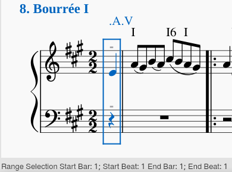

************************
Technical Specifications
************************

These specs fulfill at least two purposes:

* Keeping track of what the DCML harmony labels express
* Being a resource for researchers and developers who want to interact with them

This way, the annotation standard's current limitations become transparent
and everyone who wants to help improving them can be on the same page. The
current state of the corresponding discussions can be seen in this repo's
`issue tracker <https://github.com/DCMLab/standards/issues>`__.

What is being encoded?
======================

This section elicits the general principles and assumptions underlying the
DCML harmony annotation standard.

Segmentations
-------------

DCML harmony labels represent a score segmentation on various levels:

* key areas (tonalities)
* harmonic segments
* chord and non-chord tones are distinguished from ornaments

The annotations follow the basic principle that a key or a harmony begins at the
timestamp that the designating label is attached to and stays effective up to
the subsequent change (half-open intervals). Following this principle

* the **key** is defined for every harmony as long as the first harmony label
  comes with information about its key;
* from the first harmony label onwards, the beginning of every event falls
  into exactly one **harmonic segment**.

By **key** we understand an ordered set of unique tonal pitch classes (a
**scale**) of which
we call the first one **root** (`tonic, home, one, I, 1, (relative) DO`,
etc.). The annotation standard is an expression of the basic assumption that
the music to which it is being applied is hierarchically organised 'around'
the root. This is expressed through numbering the key's ordered pitch classes,
its scale degrees, using either Roman or Arabic numerals, depending on the
context. Tones which are not part of the key's scale are expressed in relation
to its scale degrees via the accidentals {♯♮♭} which we facilitate to {#b}.

By **harmonic segment** we understand a continuous score segment encompassing
all staves. Therefore, it has the same morphology as a slice with the difference
that the word slice is generally associated with a harmonic segment which does
have a duration but no rhythm. In that sense, harmonic segment is the more
general concept which can include anything from a single slice to a whole piece.
The criterion for harmonic segmentation is a given set of features: The music
pertaining to harmonic segments that have been identically labelled has
the same harmonic features, provided that the identical set of features has
been used as segmentation criterion in all cases.

Additionally, the standard offers the possibility to annotate **phrases**. These
cannot be hierarchically nested but most naturally they should coincide with
one given level of a hierarchical form analysis. The annotator's guidelines are
quite vague in this regard and leave it open on which hierarchical level -- if
at all -- the annotator wants to use phrase annotations.

The following section explains how the segmentations' timestamps are
encoded whereas the expression of chord and non-chord tones will be
specified in the :ref:`regEx <regex>` section below.

.. _timestamps:

Timestamps
----------

The way DCML harmony labels are entered in the `MuseScore 3 <https://musescore.org/en/download>`__
notation software ensures that each of them is attached to a timestamp in the
score. The software allows for attaching several labels to the same time point,
even in the same staff but annotators are asked to avoid this and to use
:ref:`encoded ambiguity <ambiguity>` instead. In principle, it would be possible
have one score include several simultaneous annotation layers, the labels of
which would only need to have a clearly distinguishable syntax.

By **timestamp** we understand a uniquely identifiable position. In the case of
music scores there are several possible referencing systems out of which we are
using references to a measure (bar) and a position within this measure. The
**position**, which we call 'onset', is measured from the measure's beginning
(starting from 0) and expressed as fractions representing quarter note durations
which can be easily transformed in any kind of beat representation. For example,
the position at one quarter note after beat 1 has ``onset = 1/4`` regardless of
the time signature. When it comes to referencing measures, there are two
different ways of referencing measures, as is the  case for all XML encodings of
measured music (musicXML, MEI). These two different ways we call **measure
number (MN)** and **measure count (MC)**.

* MNs represent a running count of complete measures and correspond to the
  numbers that can be found in printed scores. They follow several conventions
  (such as anacruses being numbered as 0, first and second endings having the same
  number, etc.) and are the typical way for humans to refer to measures.
* MCs on the other hand are a running count of measure units in the XML score and
  therefore they count any kind of complete and incomplete (i.e. split) measures
  alike. Therefore, they are independent of conventions and identify a certain
  measure unit unambiguously (whereas a MN might refer to several MCs). That is
  why MCs are the ideal way for machines to refer to measures.

Musescore displays both kinds of numbers: MCs are shown in the status bar when
clicking on a measure, whereas MNs are shown in the score (if activated) and in
the Navigator pane. It follows that our timestamps have to be able to mediate
between the two referencing schemes, i.e. the one for humans and the one for
machines. This requires some particular care with regard  to score consistency.
Concretely, this means that the above-mentioned conventions for MNs need to be
correctly encoded in the MuseScore files, enabling a correct mapping of MCs to
the MNs as they can (or could) be found in an original print. In particular, for
the following cases one has to ensure that an MC is "excluded from bar count"
(as it is called in MuseScore):

* anacruses;
* every part of split measures except the first one; (split measures often
  occur at section breaks in pieces maintaining an upbeat)
* all measures pertaining to a second (or third etc.) ending. For endings
  longer than one MN, MuseScore's "Add to bar number" has to be used with a
  negative value (:ref:`see below <volta_numbering>`).

    The "exclude from bar count" function is mainly needed to ensure correct
    display of MNs in Musescore, but also for dubious or non-standard cases. The
    logic of the mapping MC -> MN can otherwise be implemented easily.

Consequently, when printing a list of labels, we use *three columns* for the
respective timestamps which should satisfy all needs. Note that we count MCs
starting with 1 in order to match MuseScore's behaviour in the status bar. Also
note that there are two potential ways of expressing positions (onsets), namely
with respect to the respective MC or to the respective MN. In order to facilitate
correct conversion to beats, we generally print the latter as can be seen in the
examples below. However, for referencing a position in the score, the MN-onset
needs to be converted into the correct MC-onset. Implementation-wise this can
be accomplished by keeping track of each MC's 'offset' from the corresponding
MN's beginning, which in most cases will be 0.

.. _label_lists:

    **Correct timestamps for the beginning of Bourrée I from Bach's
    `English Suite No. 1` BWV 806.**

    +----+----+-------+-------+
    | mc | mn | onset | label |
    +====+====+=======+=======+
    | 1  | 0  | 3/4   | .A.V  |
    +----+----+-------+-------+
    | 2  | 1  | 0     | I     |
    +----+----+-------+-------+
    | 2  | 1  | 1/2   | I6    |
    +----+----+-------+-------+
    | 2  | 1  | 3/4   | I     |
    +----+----+-------+-------+

Note how in this example, the first labels'
position is given as ``onset == 3/4`` because MN 0 was internally treated as
the second part of a split bar, resulting in the above-mentioned 'offset'
value for MC 1 to be ``3/4`` which would translate correctly to beat
4 in 4/4 meter or beat 2.5 in 2/2.

    **mm. 16ff. of the same piece as an example for correct timestamps in the case
    of first and second endings.**

    +------+------+-------+-------+-------+
    | mc   | mn   | onset | label | volta |
    +======+======+=======+=======+=======+
    | 17   | 16   | 0     | V     | 1     |
    +------+------+-------+-------+-------+
    | 17   | 16   | 1/2   | V6    | 1     |
    +------+------+-------+-------+-------+
    | 17   | 16   | 3/4   | V2    | 1     |
    +------+------+-------+-------+-------+
    | 18   | 17   | 0     | I6    | 1     |
    +------+------+-------+-------+-------+
    | 18   | 17   | 1/2   | I     | 1     |
    +------+------+-------+-------+-------+
    | 19   | 16   | 0     | V\\\\ | 2     |
    +------+------+-------+-------+-------+
    |\(20\)|\(16\)|\(3/4\)|\(V\)  |\(2\)  |
    +------+------+-------+-------+-------+
    | 21   | 17   | 0     | I     | 2     |
    +------+------+-------+-------+-------+

Note how MCs identify every measure unit of the score unambiguously whereas the
official conventions intend MNs 16 and 17 to have two different appearances
which are commonly distinguished by writing `16a, 16b, 17a, 17b`. In order to
stick to an integer type for the MN column, we recommend using an
additional distinguishing column which we call 'volta' (prima/seconda volta
being the Italian way of saying first/second ending). It has to be further
noted that, since the first volta has a length of two bars and the second
a length of only one bar, the distinuishing column does not correspond 100%
to the printed voltas. The MNs are in accordance with the
`Henle Urtext Edition <https://imslp.org/wiki/Special:ReverseLookup/533082>`__.
The second-last timestamp has been added to the list
for clarity because in the score there is no label in MC 20.

.. _volta_numbering:

In order to guarantee the display of correct measures in
MuseScore for the example above, the  following configuration has to be set for
the various MCs. A ``1`` in the column 'dont_count' represents a measure unit
for which the 'Exclude from bar count' flag is set and the column 'numbering
offset' represents values for "Add to bar number". Empty cells represent zero
values.

+----+----+------------+------------------+
| mc | mn | dont_count | numbering_offset |
+====+====+============+==================+
| 17 | 16 |            |                  |
+----+----+------------+------------------+
| 18 | 17 |            |                  |
+----+----+------------+------------------+
| 19 | 16 |            | -2               |
+----+----+------------+------------------+
| 20 | 16 | 1          |                  |
+----+----+------------+------------------+
| 21 | 17 |            |                  |
+----+----+------------+------------------+

Floating point timestamps
^^^^^^^^^^^^^^^^^^^^^^^^^

Bla bla

.. _regex:

The regEx (Regular Expression)
==============================

The regular expression (regEx) is the backbone of the DCML annotation standard.
It  expresses its entire chord alphabet by defining the syntactic rules of  the
harmonic features that the standard is able to encode. At the same time, it
includes preconfigured names for the different features which can be used  to
easily split chord labels into a feature matrix with named columns. Labels that
don't match the regEx are considered as syntactically erroneous. Splitting
harmony labels into the included features enables all kinds of subsequent
processing, e.g. sorting, feature statistics, computation of extended features,
etc.

The current version of the regEx can be found in
`harmony.py <https://github.com/DCMLab/standards/blob/docs/harmony.py>`_
(the file in the development branch contains the latest version that has not yet
been released).

The regEx on the current branch looks like this:

.. literalinclude:: ../../harmony.py
  :language: python

Fetching and Compiling the regEx
--------------------------------

In Python, you could fetch and compile a particular version of the regEx like
this:

.. literalinclude:: ../../functions/get_regex.py
  :language: python

Structure of the regEx
----------------------

In the current version, the overall structure of the regex is
``(harmony_label)?(phrase_label)?`` where ``phrase_label`` corresponds to the
regEx's last group and ``harmony_label`` to everything before.

Structure of the Harmony Labels
^^^^^^^^^^^^^^^^^^^^^^^^^^^^^^^

Simplifying the regEx's harmony part to the included groups, we get

.. code-block::

    (globalkey)?
    (localkey)?
    (pedal)?
    (chord
        (numeral)
        (form)?
        (figbass)?
        (changes)?
        (relativeroot)?
    )
    (pedalend)?

which shows that the only feature that every harmony label needs to express
is (Roman) ``numeral``, i.e. the harmony's root. ``numeral`` in return is
included in the ``chord`` group, together with the features ``form, figbass,
changes, relativeroot`` which fully define a harmony's chord tones and
(structural, non-ornamental) non-chord tones.

Structure of the Phrase Labels
^^^^^^^^^^^^^^^^^^^^^^^^^^^^^^

Phrase labels can stand alone or follow a harmony label. A phrase label can be
one of the following symbols:

* ``\\``: kept for downward compatibility. In older versions of the standard,
  this was the only symbol and designated a phrase ending. This was a quite
  limited way to annotate phrases, which is why v2.2.0 introduced the following
  symbols replacing ``\\``.
* ``{``: beginning of a phrase
* ``}``: (structural) phrase ending
* ``}{``: Phrase interlocking

The logic behind the closed curly braces is that they designate a structural
ending, e.g. the position of a cadence's ultima. This implies that everything
that follows ``}`` yet precedes the subsequent ``{`` is still considered as part
of the same phrase, be it an annexe, a general pause, a transition etc. It
follows that calculating full phrase lengths is achieved from ``{`` to ``{``.

Feature Processing
==================

This section reflects the current specification of how every feature included in
the regEx is or can be processed. It's purpose is both internal documentation
and exposure to outside researchers and developers who want to use, understand,
help developing the DCML harmony annotation standard. The specifications are
exemplified by Python 3 functions.

The section retraces step by step the operations performed by the overarching
``expand_labels()`` function. It presupposes an initial data representation as a
`pandas DataFrame
<https://pandas.pydata.org/pandas-docs/stable/user_guide/dsintro.html#dataframe>`_
that includes labels and their :ref:`timestamps <timestamps>`. The example
functions use the same column names as the :ref:`above examples <label_lists>`.

Splitting the Labels
--------------------

The goal in this section is to split raw harmony labels into the encoded
features using a particular version of the standard's regular expression
(regEx). The DCML harmony annotation standard allows annotators two include a
second, alternative label, separated by ``-`` which have to be separated into
autonomous labels before applying the regEx. From v2.2.0 onwards, ``-`` can also
be part of a label (indicating omission of a chord tone) which is why a regEx
with negative lookahead needs to be used, e.g. like this:

.. literalinclude:: ../../functions/split_alternatives.py
  :language: python

When the alternatives have been moved into a separate column, the regEx can be
applied to the main column, e.g. using the pandas function
``pd.Series.str.split()``.  Since applying the regEx to labels that include
alternatives, the function ``split_alternatives()`` shown above is included in
the following example.

.. literalinclude:: ../../functions/split_labels.py
  :language: python

Missing Features
================

* encoding exact (or transposed) repetition of labels (facilitating corrections)
* vertical segmentation of which voice/s has/have the melody
