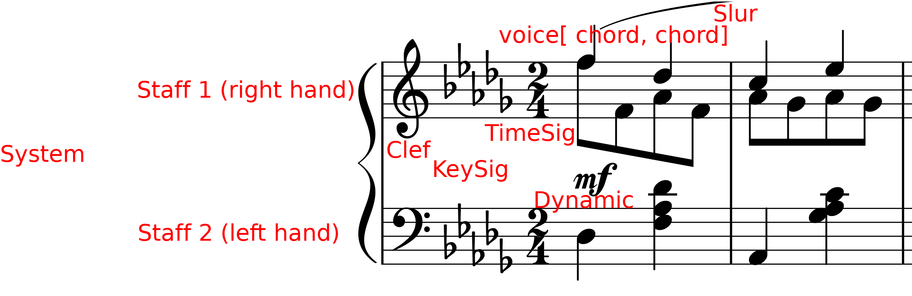
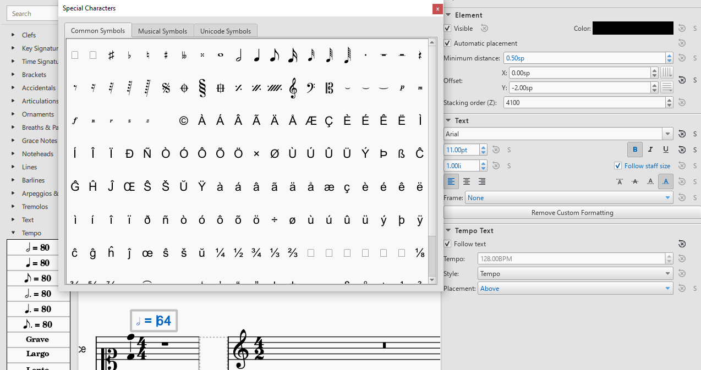

**********************
DCML Score Conventions
**********************

.. contents:: Contents
   :local:

Dividing a Score into separate files
====================================

1. Open up the MuseScore file & the original print for comparison.

2. Find out about the file name convention or invent one.

3. Find out the numbers for each movement (PDF or IMSLP)

4. Create section break after second-last movement

5. Re-add time signature and key signature to last movement

6. check & correct measure numbers (pick-up bars, voltas, etc.)

7. Select last movement, File → Save selection → save as MSCX file

8. Delete bars (Ctrl + Del)

Glossary, Terminology
=====================

System
------

The "line" of a score including all staves.

Staff (*pl.* staves)
--------------------

A score layer commonly represented by five staff lines.

Voice (Notational Layer)
------------------------

Contrary to the musical term, voice designates one of the four notational layers. Voices 1 (blue) and 3 (red) by default have upwards stems and beams, voice 2 (green) and 4 (purple) downward ones; unless only voice 1 is present, then the stem direction is automatic. In the score example, staff 1 has two voices and staff 2 only one.

Head & Stem
-----------

Every note consists of a note head (round in most cases) and every note smaller than a whole note has a stem which is the line extending upwards or downward from the stem, or both.

Flag & Beam
-----------

Individual notes smaller than a quarter have at least one flag but adjacent flags are usually represented as beams. In the score example every four eighth notes are connected by a beam.

Score Elements
==============

Line Breaks
-----------

Don’t need to correspond to the original. Where existing line breaks in the digital edition bring forth awkward layout, they should be deleted.

MuseScore Metadata, Title information etc.
------------------------------------------

Eventually the Metadata (File -> Score Properties) should be clean (i.e. complete) but this can be done in an automated step. The same goes for adding title, composer etc. for the score. So if you’re more satisfied with your work when you add this info, use Add -> Text -> Title/Subtitle/Composer… 

Staff Brackets, Bar lines
-------------------------

The brackets at the beginning of the staves make for a more professional look and are easy to add. The same goes for barlines extending over staves.

* **Brackets:** Palette -> Brackets -> Drag into score -> use the handle to extend

* **Cross-staff barlines:** Select a barline and drag it down to the last spanned staff

Cross-staff notation
--------------------

In print editions of piano music you sometimes find the left hand notated in the upper staff or vice versa. By default, this should not be reproduced.

First and second endings ("voltas")
-----------------------------------

The convention is that second, third etc. endings are seen as alternative versions of the same measure numbers (MN). Therefore, the bar counts need to be adapted in MuseScore accordingly. If the voltas have length 1, it is sufficient to "Exclude from bar count" all voltas except the first one. For voltas spanning n > 1 measures, for every volta except the first, the first measure needs to be adjusted with “Add to bar number = -n”.

Example:

* Volta 1: MC 15 & 16 → **MN 15a & 16a**

* Volta 2: MC 17 & 18 → **MN 15b & 16b** ← change MC 17 to "“Add to bar number = -2"

Sections within a movement (e.g. "Trio")
----------------------------------------

Individual sections, in particular ones with differing time and/or key signatures, occur frequently in musical settings such as variation movements or Minuet + Trio. Three important considerations are:

* how to layout the section breaks

* how to yield correct measure numbers

* how to ensure correct repeat structure

A section break (from the "Breaks & Spaces" pallette) has the following effects:

* MN (bar counts) restart counting from 1 (but not the MCs);

* a line break is inserted;

* after the line break, the time signature and the key signature can be changed without automatic creation of "courtesy display" at the end of the previous line;

* a last section measure and the first one of following section don’t need to add up to the correct measure length (e.g. when performing checks with ms3)

* repeat signs in the new section jump back to the section’s beginning, not the movement’s beginning (for which D.C./da capo is used, see below). By convention, the "start repeat" sign in the first MC of a new section is omitted.

So in general, **section breaks should be used**. If, however, the MNs in the original score don’t restart from 1, you need to adapt the "Add to bar count" setting of the new section’s first measure. The title of the new section should be added as **system text** with a larger font size.

If the movement contains jumps such as D.C./da capo or D.S./dal segno, make sure that these signs exist and have the correct **labels**. For example, if at the end of a Trio there is a "Menuetto da capo" you need to make sure that the first section, the Minuet, is played once more, **without repeats**, and without continuing to the Trio. This can be achieved by creating a “D.C. al Fine” from the “Repeats & Jumps” pallette, adapting the text, and, importantly, by creating a “Fine” at the end of the minuet. The “Play repeats” option is correctly disabled by default.

Beams
-----

Beams can be adjusted for aesthetic reasons but don’t need to be.

Notational Layers & Stem direction
----------------------------------

As long as there is only one voice (notational layer) per staff, the automatic stem directions are perfectly fine. If there are more than one, the four layers of MuseScore should be used in order to reproduce the stem directions as in the original. By default, voices 1 and 3 have upward stems, voices 2 and 4 downward stems.

Piano pedals
------------

Since the use of the sustain pedal is part of a pianist’s personal style, pedal markings are to be considered as rough suggestions and often they are added by editors. They should be included if they can be found in the original manuscripts.

.. _metronome_marks:

Metronome marks
---------------

Each score should have a metronome mark in the first measure. If the source does not contain one, it should be added
as an invisible mark. The base value should reflect the beat unit of the music and the bpm value should correspond
to a reasonable estimate of the tempo when averaged over various performances. Notably, when the base unit or the
tempo indication changes later in the piece, another metronome mark should be added.

Please make sure to add an (invisible) metronome mark **even if the piece begins with a :ref:`tempo indication
<tempo_indications>**. The reason is that the latter encodes the tempo based on quarters, whereas the
metronome additionally encodes the information on what is considered to be the beat unit.

In order to add a metronome mark, you select the first measure in the first staff and, in the "Tempo" palette,
click on the metronome mark with the corresponding beat unit. Double-click on it and change the number to change the
tempo. In the inspector (F8), the "Tempo" value is updated accordingly and shows the tempo you are encoding, but
converted to a base unit of quarters (in the screenshot below, "𝅗𝅥 = 64" corresponds to "128.00BPM"). There you can
also uncheck the "Visible" box to hide the marking (or press [V]).

If the required base unit is not available in the palette, create one of the existing metronome marks, double-click,
and press [F2] to open the "Special Characters" pop up. There you can select the base unit and insert it (and
prolongation dot) accordingly. Again, check in the inspector if the tempo is encoded correctly.

   On the left, the "Tempo" palette (F9) is shown. On the right, the "Inspector" (F8) that shows the encoded tempo
   in terms of quarters per minute. The "Special Characters" pop up in the center can be opened by pressing [F2] while
   editing the metronome mark (double click).

.. _tempo_indications:

Tempo indications (aka movement title)
--------------------------------------

The most frequent tempo indications such as ``Andante`` or ``Allegro`` are available from the "Tempo" palette.
For those that are not available, you insert one of the available ones and modify its text by double-clicking on it.
Then you open the inspector (F8) and change the value of "Tempo" (in the "Tempo Text" pane) to a plausible value
(measured in quarters per minute). In addition, please also add a :ref:`metronome mark <metronome_marks>` in order
to encode the beat unit.

Cresc. / Decresc.
-----------------

Should not be written as plain text, instead use the symbol from the "Lines" palette. If the original score has no line,
make it as short as possible (the length of the note value). The length of a line is modified by selecting its right
handle (square), holding [C]+[S] and moving the end of the line with the right and left arrow keys. Alternatively,
the handle can be dragged with the mouse.

Titles and other metadata
-------------------------

Metadata can be inserted automatically but if you want to do it by hand, use

* **Title** for the title of the work group (e.g. "4 Mazurkas, op. 6") or the work if it is standalone

* **Subtitle** for movements or parts of the work group (e.g. "Mazurka in F# minor, op. 6 no. 1")

Early Music
===========

Preparatory staves
------------------

* Create a horizontal frame between the first and second bar of the score. The isolated measure on the left of the frame will be referred to as the preparatory staff for each part.

* Exclude the preparatory staff from the measure count, and make the content of the bar invisible.

* Insert the grouping bracket for the whole system of staves. 

* For each part, change the clef in the preparatory staff to the corresponding ancient clef, making sure to restore the modern clef at the beginning of the score after the frame (hiding the courtesy clef). 

* For each part, change the **aspect** of the time signature in the preparatory staff to the corresponding ancient notation. Ancient metrical signatures can be found in the "Other" menu. Make sure the modern time signature is correctly displayed at the beginning of the score, after the frame. 

* After transcribing the whole piece, add the Ambitus inside the preparatory staff for each part with the dedicated tool (from the "Lines" palette). The ambitus should be set automatically with the correct range, but it can be adjusted manually in the Inspector.

Accidentals
-----------

* When copying from a manuscript or primary source, only transcribe accidentals that are present in the original, without adding *musica ficta* or other editorial interventions.

* Since ancient sources do not assume measure boundaries, always interpret an accidental as only referring to the note it is attached to. This implies that every successive note in the same or the following measure that the accidental would apply to needs to have a natural sign in parentheses. In other words, the only notes having accidentals without parantheses are those in the original source. Please stick to this convention because it facilitates the task for the person who will go through all accidentals seperately.

* When copying from an authoritative critical edition, or making editorial revisions on new transcriptions, unambiguous *musica ficta* accidentals should be included and displayed **in small font** (*Small* tag in the Inspector) above the corresponding note. Less unambiguous cases can also be annotated **in brackets** (*Bracket type* menu in the Inspector).

* Any occurrences of a notated B sharp should be transcribed as B natural. 

Text
----

* When transcribing from manuscripts or other primary sources, spelling inconsistencies and lexical archaisms for the same word should be transcribed as they occur in the source.

* On the contrary, ancient typographical features should be systematically modernized. This includes:

    * Letter "s" may be displayed as a s-*longa* “ẝ”, not to be confused with an “f”. Always restore the modern notation as “s”. 	

    * Letter "u" is displayed as a “v” when it occurs at the beginning of a word, but should be restored as a “u”.

    * Letter "v" is displayed as a “u” when it occurs in the middle of a word, but should be restored as a “v”.

    * A tilde above a vowel indicates that it should be followed by a letter "n": e.g., “comãdo” → “comando”.

* Sources may omit repetitions of lines of text, replacing them with a symbol (e.g., ":||:" or “ij”). In the transcription, write out the repetition explicitly, enclosing the portion of text that is omitted in the source within square brackets (e.g. “Fa la la ij.” → “Fa la la [Fa la la]”). 

* Initial capital letters may be illustrated separately from the score, and should be merged with the first syllable in the transcription.

* Distribution of the lyrics:

    * Text should be hyphenated syllabically (separating syllables with a dash - when splitting a word, and with a space when starting a new word), even when hyphens are omitted in the source. When in doubt, refer to standard language-specific syllabation rules.

    * When syllables belonging to different adjacent words merge in a single metrical position (synalepha), separate them with Alt+Space so that they are not assigned to different notes. E.g., the verse *Tu di luce auanzi il Sol* will be transcribed as: "*Tu*" “*di”* “*lu*” - “*ce a*” - “*van*” - “*zi il*” “*Sol*”, where each segment enclosed in “” is assigned to a single note and the space inside “ce a” and “zi il” is obtained with Alt+Space. 

    * When a syllable extends over several notes (melisma), a dash - should be used for each note belonging to the melisma, until the next syllable intervenes. If the melisma occurs on the final syllable of a word, an underscore _ should be used (instead of the dash) for each note of the melisma, until a new word starts.

Ligaturae
---------

* If the source marks *ligaturae*, include them as dashed slurs (*Line type* → *Dashed* in the Inspector).

Meter
-----

* Transcriptions preserve original note values, not halved ones.

* Meter changes:

    * Select the new time signature in modern notation.

    * If the new time signature in the source is numeric (e.g. 3) orｃor ȼ, change the **aspect** of the time signature to match the original notation.

    * If the new time signature in the source is in ancient mensural notation (e.g., ꜿ), include the ancient notation as a symbol from the Master Palette → Symbols → Medieval and Renaissance Prolationes. The symbol should be attached to the relevant measure, and positioned right above the modern time signature.

    * Recitativo passages and other unmetered material should be encoded as a single measures with irregular length rather than multiple measures (regular or otherwise) with hidden barlines,

* The last note is often notated as a *longa*. If this is the case, the transcription should end on exactly one bar in which all sounding voices hold their final note for the duration of the entire bar (if necessary, add one bar at the end). Fermatas are added only if they appear in the original score.

Metadata
--------

* Add the field *originalClefs* and report the original clefs from the topmost to the bottom staff. E.g., "c1, c2, c4, f4", where “c1” stands for a C-clef on the lowest line of the staff, c2 for a C-clef on the second-lowest line etc. 

Corrections to automate
=======================

General
-------

* make sure no notes are vertically shifted

Files converted from `Kern/Humdrum <http://kern.humdrum.org/>`__
----------------------------------------------------------------

* moving dynamic markings from <Lyrics> to <Dynamic> tags

* correcting messed up hair pins (cres./decresc.)

Annotations
-----------

* delete empty harmony tags

* labels missing initial dot

