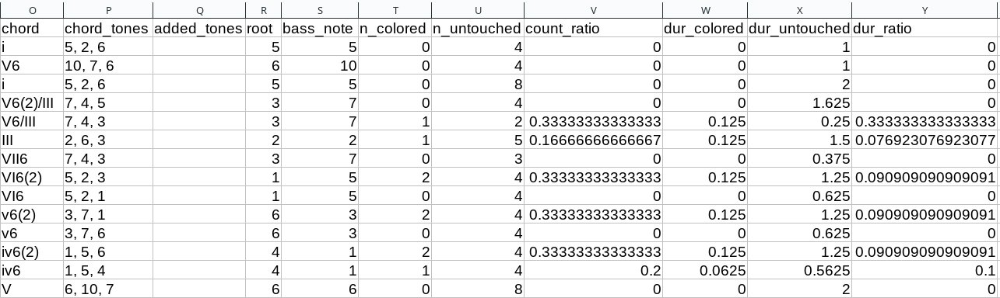
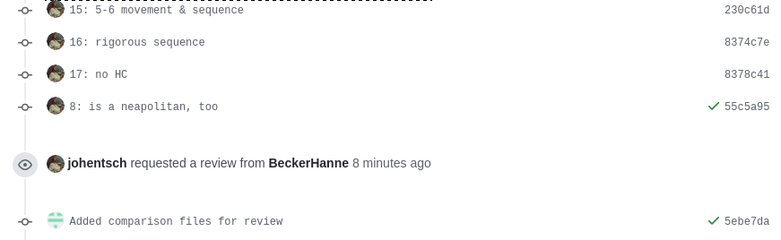
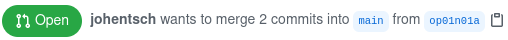
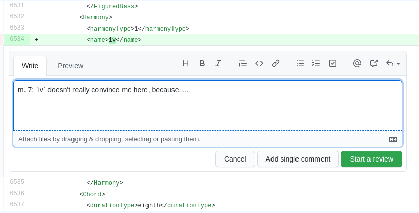

************************
DCML annotation workflow
************************

.. contents:: Contents
   :local:
   :depth: 2

.. note:: It is of utmost importance that annotators have a basic understanding of version control and branching
   via Git before they get familiar with the DCML annotation workflow. Our :ref:`Quick reference <git-intro>`
   contains the bare minimum of what annotators need to know, but if you're completely new to Git, please make sure
   to read, watch, or do a couple of tutorials online.

.. admonition:: Summary of workflow update December 2022
   :class: caution

   * Before annotating or upgrading a piece, the assignee adds an invisible metronome marking to the first bar.
   * Annotation/Upgrade and Review take place in the same Pull Request (no prior merging into ``main``!).
   * ``_reviewed`` files now to be found in the ``reviewed`` folder. A couple of things are new:

     * The red and green labels now reflect the changes between the current set of labels and the previous bot commit,
       i.e. since the last time someone pushed changes to the MuseScore file in question.
     * The ``_reviewed`` files show all out-of-label notes in red.
     * The ``reviewed`` folder additionally contains :ref:`TSV files that reflect the note coloring <review_reports>`

   * When the bot checks the modified scores and encounters any warnings (including those concerning mismatches between
     labels and scores) it will write them into the ``warnings.log`` file for you to look them up. It's commit message
     will end on ``(tests failed)``.
   * Everytime a Pull Request is merged, the bot will perform the review on all scores. That is to say, the
     ``warnings.log`` file on the ``main`` branch shows all remaining errors.
   * Sometimes, warnings that cause the tests to fail are due to irregularities in the original scores. To make the
     test pass anyway, we :ref:`add the warning to an IGNORED_WARNINGS <ignored_warnings>` file, potentially with a
     comment for other humans.

Short summary
=============

#. Annotator:

   * (:ref:`Takes on the work package via OpenProject <taking_on_a_task>`)
   * **creates a new branch (splitting off of the main branch!) named after the file to be annotated**
   * **pushes annotations and corrects errors that were** :ref:`automatically detected on GitHub <syntax_errors>`,
   * **creates Pull Request (PR)**
   * (:ref:`On OpenProject: links PR, changes status, logs costs <after_the_task>`)

#. Reviewer:

   * (:ref:`Takes on the work package via OpenProject <taking_on_a_review>`)
   * **reviews the annotations and commits every change separately into the open PR**
   * **approves the changes on GitHub, enabling the annotator to agree and merge**
   * (:ref:`Logs the cost on OpenProject <logging_costs>`)

#. Annotator:

   * **Pulls the changes and goes through reviewer's commits in the PR**
   * **in case of disagreement, enters into discussion with reviewer until consensus is reached**
   * **merges PR as soon as both parties agree on a set of labels.**
   * (:ref:`Finalizes the package on OpenProject, enabling invoicing <after_the_task>`)

More details can be found below.

.. _annotating:

Annotating
==========

Head to your local clone of the repository in which you want to annotate a piece and update the main branch.
  ::

    git checkout main
    git pull

Create a new branch that has exactly the same name as the file you are going to annotate.
  In this example, we want to annotate the first movement of Corelli's first trio sonata which is called
  ``op01n01a.mscx``, so we do::

    git checkout -b op01n01a

Annotate the piece.
  Open ``op01n01a.mscx`` with the latest version of MuseScore and insert your labels while saving the file
  from time to time. Don't forget to create the following metadata fields by going through the menu
  ``File -> Score Properties...``:

  * ``annotators`` (plural form!): your name
  * ``harmony_version``: version of the annotation standard you are using (currently 2.3.0)

  .. figure:: img/musescore_metadata.png
      :alt: Entering metadata in MuseScore
      :scale: 80%

      Entering metadata in MuseScore

  Then, make sure that the score has an invisible metronome mark that reflects the tempo you're imagining.

  .. admonition:: Tip
     :class: note

     There are online metronomes that let you tap/click and tell you the tempo, e.g. https://online-metronome.org/

Commit your changes locally and describe the commit in the commit message.
  ::

    git add MS3
    git commit -m "annotated mm. 1-15"

  .. hint:: Since you'll use these commands quite a lot, you might want to create aliases, i.e., shortcut commands,
     for example ``ga`` and ``gc``. A web search for "create alias [your operation system]" will tell you how.

  Other examples for meaningful commit messages could be ``"annotated the entire movement"`` or ``"fixed syntax error
  in m. 17"``. Please include measure numbers whenever applicable.

Push your commits to GitHub and check if syntactical errors are detected.
  ::

    git push

  .. note:: At first (unless you have activated ``push.autoSetupRemote``, see :ref:`configuring_git`)
     you will be asked to connect your new local branch to GitHub using the command
     ``git push --set-upstream origin op01n01a`` or whatever the name of the new branch is.

  Everytime you push your commits to GitHub, the scores you've modified will be checked automatically and you can see
  immediately if there are any syntactic errors or where the notes in the score do not match the label. At the end
  of the automated check, a bot will add or modify two :ref:`review reports <review_reports>` that might help you spot
  or make sense of errors. To see these files, you will need to update your local clone so that it includes
  the bot's commit: ::

    git checkout op01n06a
    git pull

  If you want to see the test result,
  simply head to the GitHub repository and click on the ``Actions`` tab.
  There you will see your last commit with a small coloured symbol:

  :yellow: Check in progress (wait a couple of seconds)
  :green: Everything OK
  :red: Syntactical error(s) detected

  .. figure:: img/github_actions_tab.png
    :alt: The last commit listed in the ``Actions`` tab with the red icon symbolizing that the syntax check failed.
    :scale: 80%

    The last commit listed in the ``Actions`` tab with the red icon symbolizing that the syntax check failed.

  When tests have failed, please go back to your local MuseScore file and commit the changes necessary to make them pass
  next time you push. Remember to include explanatory commit messages and measure numbers.
  Still under the ``Actions`` tab, click on the failed syntax check and then on ``perform_check``

  .. figure:: img/github_check_perform_check.png
      :alt: Click on "perform_check"
      :scale: 80%

      Click on "ms3_review"

  Put the word "warning" into the black search bar and go through all warnings.

  .. figure:: img/github_syntactical_errors.png
      :alt: Log of ms3 review showing incorrect labels
      :scale: 90%

      Output log of the `ms3 review` command; use the search bar to go through every `_WARNING`.

  Where applicable, every warning comes with a measure count ``MC`` and/or a measure number ``MN``. MC corresponds
  to the bar number that MuseScore displays in the
  status bar on the bottom left (not always identical to the measure number (MN) in the score). The warning's message
  is hopefully expressive enough for you to know what to do. If not or you're unsure, you may look it up in the
  :ref:`section on warnings <warnings>` below. After doing the necessary steps, commit and push again,
  and the test should pass this time.

Once all your labels are syntactically correct, create a Pull Request.
  There are (at least) three different ways for creating a Pull Request (i.e. a request for merging your annotations
  from the new branch into ``main``):

  1. Head to the main page of the GitHub repository where you should see a banner allowing you to quickly create
     a pull request:

     .. figure:: img/github_pr.png
        :alt: GitHub offering to creat a new pull request

        GitHub offering to create a new pull request with the recently pushed annotations

  2. Otherwise, select the new branch from the dropdown menu

     .. figure:: img/github_select_branch.png
        :alt: Selecting a branch on GitHub

        Selecting a branch on GitHub

     and click on ``Contribute -> Open pull request``

     .. figure:: img/github_open_pr_from_branch.png
        :alt: Opening a PR directly from the branch.

        Opening a PR directly from the branch.

  3. Or, head to the ``Pull requests`` tab, click on "New pull request" and select your branch accordingly, like this:

     .. figure:: img/github_create_pr.png
        :alt: Giving the new pull request a meaningful title

        Giving the new pull request a meaningful title

Give the pull request a meaningful name including the exact file name, and
include the URL of the OpenProject work package in the description.
Feel free to add anything worth knowing below, e.g. specific measures where you would like to ask the reviewer for
a second opinion. Once you confirm with
the green button "Create pull request", you're done on GitHub; don't forget to
:ref:`change the status and log the costs on OpenProject <after_the_task>`.

.. admonition:: Important
   :class: caution

   Before you continue with the next task, make sure to checkout and pull the ``main`` branch before creating the new branch.

.. _review_reports:

Review reports
--------------

.. note::

   Don't forget to update your branch using ``git pull`` after the bot has committed files.

If a commit includes modified MuseScore files, a bot will check them and add or update two review reports which are
located in the folder called ``reviewed``. They include

* a score where all non-chord tones are colored in red and, if the score already contained labels before the commit, it
  displays the changes applied to the labels in green and red;
* and a TSV file that lists all the labels and where the last 6 columns contain the results of this coloring:

   Example review report for the beginning of Corelli's ``op01n06a`` (showing only relevant columns).

The ``chord`` column is the one that is translated into ``chord_tones``. Different from the TSV files in the
``harmonies`` folder, where it displays scale degrees, the integers here are to be interpreted as absolute notes
expressed on the line of fifths. For example, the first chord, ``i`` translates to ``(5, 2, 6)``, and reads as
``B, D, F#``. The last six columns describe properties of all notes that start in the given chord segment:

* ``n_colored``: Number of red notes, i.e. notes that are not covered by the chord label.
* ``n_untouched``: Number of black notes, i.e. notes that are included in the label.
* ``count_ratio``: Ratio between red vs. all notes in the segment. Values over 0.6 will cause the test to fail and
  warn the annotator.
* ``dur_colored``: Summed durations of red notes, expressed in quarter notes.
* ``dur_untouched``: Summed durations of black notes, in quarters.
* ``dur_ratio``: Ratio between summed durations of red vs. duration of all notes in the segment.

.. admonition:: December 2022
   :class: caution

   As of now, this check suffers from the problem that it considers only note heads in the given chord segment, meaning
   that notes sounding since earlier are not taken into account and that durations are not cut off when the chord segment
   ends. This will be improved in a future version.

.. admonition:: Little trick
   :class: note

   To quickly make sense of higher values on the line of fifths, such as ``(10, 7, 6)`` in the second row, it helps to
   think in chromatic shifts, 7 fifths. In other words we can read this as ``#3, #0, #-1``, i.e. ``#A, #C, #F``.

.. _modulation_plans:

Modulation plans
----------------

.. admonition:: December 2022
   :class: caution

   The updated workflow does not yet output modulation plans.

Since November 2021, the DCML workflow includes a new feature, namely the automated creation of modulation plans.
Once a Pull Request (PR) is created, modulation plans are generated and updated for all altered MuseScore files. They
come in the form of HTML files and are stored in the folder ``tonicizations``. After you create a PR or push into an
existing one, the ms3-bot will commit these files, so in order to view them, you need to wait for the bot's commit
and then pull it into your local clone.

For example, in `this PR <https://github.com/DCMLab/schubert_dances/pull/516>`__,
the annotator pushed a new set of annotations, requested a review and then the bot added
the HTML file in the commit "Added comparison files for review". In order to view the file, the annotator will
do a ``git pull``, find it in the folder ``tonicizations`` and open it in a browser:

.. raw:: html
   :file: interactive/D718walzer01.html

:Gantt chart: *Automatically generated modulation plan in HTML format, displayed through a browser.*

The modulation plans display the tonal hierarchy represented by your annotations and allow you to check if your labels
correspond to your understanding of the piece's structure. The keys that the piece modulates to are shown in blue,
temporary tonicizations (slash notation) are shown in red, and adjacency of the tonicized numerals in green. More
detailed information on the keys is shown when hovering over the figure. If you find inconsistencies, simply
correct them in your MuseScore file and commit them into the open PR, the modulation plan will be updated and overwritten,
so you can pull it and check it once more.

Upgrading annotations
=====================

Upgrading an existing set of annotations created under an older version of the DCML annotation standard roughly
follows the same workflow as the :ref:`creation of new labels <annotating>` above. The main difference is that during
the upgrade, you commit your changes individually, justifying each of them in a commit message starting with the
respective measure number.

Create a new branch and adapt the metadata.
  As an example, let's upgrade the labels of ``op01n06a.mscx`` from version 2.1.1 to 2.3.0. In this screencast,
  the score is already open and you see how the metadata is updated and committed to a new branch called ``op01n06a``.

  .. note:: that the commands ``ga`` and ``gc`` are aliases, i.e. shortcut commands, which you would replace by
     ``git add MS3`` and ``git commit -m`` respectively (unless you have created your own aliases).

  .. figure:: img/upgrade_metadata.gif
     :alt: Updating the metadata reflecting the version upgrade.

     Updating the metadata reflecting the version upgrade. The screencast starts at ``cd corelli``.

  As you can see, the metadata field ``annotators`` is updated in a way that the old version is added to the previous
  annotators and that the upgrader adds themselves to the annotators, indicating the new versions. Since the version
  upgrade includes a review of the existing labels, they also add their initials to the ``reviewers`` field.

Review and update the labels and commit your changes individually.
  The following screencast demonstrates the upgrade process of ``op01n06a.mscx``. In principle, after every change
  the file is saved and the change is committed with the measure number and an explanation.

  .. note:: that the commands ``ga`` and ``gc`` are aliases, i.e. shortcut commands, which you would replace by
     ``git add MS3`` and ``git commit -m`` respectively (unless you have created your own aliases).

  .. _individual_commits:

  .. figure:: img/upgrade_commits.gif
     :alt: Giving the new pull request a meaningful title

     Creating individual commits for every change or group of changes. The screencast produces the syntax error
     ``V6/III(2)`` (instead of ``V6(2)/III``) that is automatically detected upon push to GitHub (see screenshot below).

  As you can see, similar changes can be grouped as one commit, as for m. 2. Phrase annotations such as the added
  curly bracket in m. 1 do not need to be committed individually.

Push your commits and create a Pull Request
  From here on, the procedure is the same as for new annotations, only that the PR will be called something like
  ``Upgraded op06n01a to 2.3.0``. Just like for new annotations, your version will be syntactically checked. For
  example, the mistake in the above screencast will be displayed like this:

  .. figure:: img/github_syntax_error.png
     :alt: Automatically detected syntax error from above, as displayed on GitHub.

     Automatically detected syntax error from above, as displayed on GitHub.

  Shortly after opening the PR, the ms3-bot will create two additional files that will help you and the reviewer
  understand your changes: An additional MuseScore file showing all changes you have made, and a :ref:`modulation plan <modulation_plans>`
  (in the folder ``tonicizations``) reflecting your updated set of labels. To see these files, you will need to
  update your local clone so that it includes the bot's commit: ::

    git checkout op01n06a
    git pull

Reviewing a set of annotations
==============================

.. admonition:: Update December 2022
   :class: note

   Before the update, this section explained how the reviewer would have to first merge the PR and then merge the main
   branch back into the annotation branch. This is not required anymore and reviewers simply add commits into the
   open PR.

.. _new_annotations:

Preparing the review
--------------------

First, open the Pull Request containing the new labels and check if all syntactic errors have been corrected.
  As can be seen in the following image, in the PR, all commits made by the annotator and by the ms3-bot are listed,
  two in this example.

  .. figure:: img/github_pr_commits.png
     :alt: A pull request were some syntactic errors have not been corrected yet.

     A pull request were some syntactic errors have not been corrected yet.

  It is important to notice that the last commit made by the annotator (``writes metadata into scores``) has a red cross instead of a green check. Although
  the last commit by the ms3-bot has a green check, the error persists (bot's commits are not checked for syntactical
  correctness). In this case, please leave a comment below, asking the annotator to correct the labels and to let you
  know once they are done.

Checkout the annotation branch and pull the changes.
  ::

    git checkout <branch>
    git pull

.. _how_to_review:

Doing the review
----------------

Now you are ready to start your review.
  * At first you start by adding your initials to the metadata field ``reviewers`` (plural!), comma-separated in case
    the field is already populated. Doing that, you may also want to check whether the annotator spelled the fields
    ``annotators`` and ``harmony_version`` correctly.
  * Check if the score has an invisible (unless written by the composer) metronome mark reflecting a tempo that you
    could agree on. If not, create or modify it as an individual commit.
  * **Update November 2021** If present, check the associated :ref:`modulation plan <modulation_plans>`
    by finding the corresponding HTML file in the folder ``tonicizations`` and opening it in your browser. It helps
    to check if the tonal structure expressed by the labels corresponds to the one you and the annotator have in mind.
  * Reviewing a new set of annotations means reading through the labels to see whether you agree with
    each of them on the basis of the :doc:`annotation tutorial <../tutorial/index>`, paying special attention to
    consistency within the piece and consistency across similar annotated pieces.
  * For every label where you feel the need to remove, reinsert, or replace it, you do the change directly in the
    MuseScore file, save it, and commit the alteration giving as a commit message the measure number(s) and your
    justification. In the case of obvious mistakes, it is enough to indicate the replacement, as in
    ``"4: #viio/V => viio/V"``. You may indicate commits were your change is a suggestion that you would be happy
    to discuss by a trailing question mark, e.g. ``"15.2: how about including V65 as an alternative label?"``.
    You may also address the comments and questions that the annotator had left with their original PR in commit
    messages, or you could address them in comments, as explained below.
    The procedure is technically identical with the :ref:`example screencast above <individual_commits>`.
  * Once you are happy with the labels in their entirety, you are ready to push your changes and see whether the
    syntax check passes.
  * **Important:** Go the ``Files changed`` tab in the Pull Request, click on "Review changes", set the radio button to
    ``Approve``, leave the annotator a few friendly words, and click on "Submit review". Before you do this step, the
    PR cannot be merged. By approving you are giving "green light" for the merge. If, on the other hand, you think
    the set of labels isn't quite there yet, you can set the radio button to "Request changes" and write a detailed
    comment on what you think needs further improvement, justifying why you did not do the change yourself.

Engage in the discussion
------------------------

* From here on, monitor your GitHub notifications for reactions to your PR from the annotator. Use the comment
  function to discuss individual solutions until you find a consensual one for each controversial label. This
  process usually includes you and the annotator committing further changes to the MuseScore file with
  expressive commit messages (always including the measure number). In case you are working with the automatically
  generated ``_reviewed`` file to display the changes made in the last commits, be aware that you never commit changes to this
  file, since they will be overwritten automatically.
* In the (rare) case where you would be unable to form a consensus, please include in the discussion a third person
  of whom you think they could bring in weighty arguments. Another way would be to bring the discussion to a
  Mattermost channel if you think the question requires a fundamental decision based on a larger consensus.
* Once the new annotations correspond to a consensus between you and the annotator, please "approve the change"
  (see above) so that the annotator can merge the PR.

Reviewing a set of upgraded annotations
---------------------------------------

Making use of the ``_reviewed`` file.
  In the case that existing labels were upgraded, the bot will have created a ``_reviewed`` file in the ``reviewed`` folder
  that shows which labels between the current and the last bot commit.
  This means that for starting the review, you can checkout and pull the corresponding branch and view the file to
  see all changes made by the upgrader. Once you commit your changes on top,
  the file will be updated to reflect the changes between the deprecated labels
  (those that the upgrader updated) and the final version after your review. If you were to instead generate a file
  reflecting only the differences before and after `your` review, you would have to follow the steps in the
  :ref:`previous section <new_annotations>`, i.e. merge the PR and open a new one.

Review the labels
  The procedure is essentially the same as the one for :ref:`reviewing new annotations <how_to_review>` above. The difference is that you focus
  more on the labels changed by the upgrader, exercising particular care for potential inconsistencies that might
  have arisen; for example by applying a change to one place but not to an analogous one; or by having missed a
  subtle aspect in the previous, replaced label, that actually made for an ideal solution; etc.

Reacting to a review & reaching expert consensus
================================================

Once your file(s) got reviewed, the reviewer creates a pull request (PR) and requests your review. You should
receive an e-mail notification, if not, please check your GitHub settings. Now your task is to go through all changes
and see whether you agree with all of them. Here is how:

How to review a review
----------------------

Open the PR from your notification e-mail or go to GitHub and open the ``Pull requests`` tab where you should see it.
The PR lets you inspect all changes and start discussions. Most importantly, after opening it, you will see all
commits made by the reviewer:

    List of commits made by the reviewer

Clicking on one of them will show you the corresponding changes in the MuseScore file. But it might be hard for
you to assess the changes without looking at the actual music. Therefore:

The last commit, called "Added comparison files for review", was made automatically by ``ms3-bot``,
creating an additional MuseScore file with the suffix ``_reviewed``. Therefore, the first thing you want to do to
review the review, is locally checkout and pull the branch corresponding to the PR
(it should be the same you created for annotating). As an example, if in the PR it says

    johentsch wants to merge 2 commits into main from op01n01a

it means you do::

  git checkout op01n01a
  git pull

Now you should have the comparison MuseScore file  ``_reviewed``
in your local clone and can open it in MuseScore. It shows unchanged labels in black,
labels removed by the reviewer in red, and labels added by the reviewer in green.
The sole purpose of this file is to help you with the review of the review and will be deleted
at some later point (it is not listed in the metadata either). In case this comparison file (and the corresponding
commit ``Added comparison files for review``) is missing, the reviewer might have made a procedural mistake and
you should ask for it to be created before you review the changes.

How to finalize the review of the review
----------------------------------------

Now you can go through the list of commits one by one and check how they play out in the comparison file. For every
change that you agree with, there is nothing you need to do. In cases where you don't agree, you write a comment
on GitHub (see next subsection) and discuss with the reviewer until you find a solution that satisfies both analytical
views. In addition, you may want to suggest a new label by integrating it in the *original* file (not the
``_reviewed`` file) and committing the change with a meaningful commit message that includes the measure number
(e.g. ``"14.4: included my original solution V43(4) as an alternative solution"``).
Once you push the changes, they will be included into the PR and the comparison file will be updated accordingly.
As soon as the original file contains a set of annotations that you and the reviewer agree to be the best possible
solution, the person who made the last
decision in the process merges the PR. As a last step, go to the main branch, wait for the automatic
``Automatically added TSV files from parse with ms3`` commit, and check if the corresponding table row in the
README got updated correctly (otherwise, the metadata fields in the MuseScore file were not correctly populated).
The piece has now been finalized and is ready for eventual publication. Thank you!

How to start a discussion
-------------------------

To start a discussion, click on the commit you disagree with. On the left you see in red your previous version and
on the right, in green, the changes made by the reviewer. Hovering over the code lines, you will see a blue plus
that lets you add your comment. It is important that you add the measure number so that the reviewer can find
the spot and react to your comment.

.. _pr_comment:

    Starting a discussion by commenting the reviewer's commit

The comments and resulting discussions will be visible in the PR's "Conversation" tab (under the list of commits).
Don't forget to press the Subscribe button on the right to get informed about reactions to your comments.

.. _warnings:

What to do about the warnings?
==============================

There can be a range of reasons why you may see a ``WARNING`` in the output log of the automated tests. They may arise
due to

* :ref:`syntax_errors` (e.g., one or several labels do not conform to the current version DCML harmony annotation syntax)
* :ref:`semantic_errors` (i.e., one or several labels express chord tones that match the notes in the given segment(s)
  badly or not at all)
* :ref:`encoding_errors` (e.g. one that leads to wrong measure numbers)

If you are currently annotation or reviewing annotations, you need to take care of the first two types. Should you
encounter encoding errors, please mention them in your Pull Request. In case your test fails but, instead of a warning,
you get a (somewhat cryptic) error, this might actually a bug, i.e. mistake in the code. If you think it is,
please `create an issue <https://github.com/DCMLab/dcml_corpus_workflow/issues>`__
and point us to the error, e.g. by pasting the output or a link to it, and the score in question so we can look into it.

There are three ways to deal with a warning:

Fix it.
  If the warning message is clear and points you to the relevant spot in the score, you simply go ahead, fix it and
  commit the change. If not, please look at the list of warnings below to see if there are instructions on how to
  fix it. Otherwise, please ask for help on Mattermost.

  If you have the ``ms3`` command set up locally, before pushing you can run

  .. code-block:: bash

     ms3 review -M -N -X -F -D -i <filename>

  in order to see if the warning is indeed gone. ``<filename>`` is a regular expression that lets you filter the files
  you want to check. For example, if the filename convention is something like ``op<##>n<##>_<movement>.mscx``, we could
  execute ``ms3 review -M -N -X -F -D -i op02`` to review all files containing "op02" in their names, or "02n02" for
  op.2, no.2 only.

Declare it a false positive.
  If you think the warning is not warranted, you can add it to the :ref:`IGNORED_WARNINGS <ignored_warnings>` file
  together with an explanation why this warning should be ignored for all times.
  This will prevent it from being displayed again.

Create an issue to make sure someone deals with it later.
  If dealing with a warning that is not part of your current workflow (e.g., an encoding error when annotating or
  harmonizing), you can create an issue for the relevant repository on GitHub to make sure someone deals with it later.
  If you want to get your PR through despite the warning, please add a comment mentioning that.

.. note::

   If the following list of warnings does not include information on how to fix one, it is assumed that the warning
   message itself is expressive enough. Otherwise, please let us know, e.g. by
   `creating an issue on GitHub <https://github.com/DCMLab/standards/issues>`__.

.. _syntax_errors:

Syntax errors
-------------

.. _warning_8:

#8 DCML_HARMONY_KEY_NOT_SPECIFIED_ERROR
^^^^^^^^^^^^^^^^^^^^^^^^^^^^^^^^^^^^^^^

.. _warning_12:

#12 DCML_HARMONY_INCOMPLETE_LOCALKEY_COLUMN_ERROR
^^^^^^^^^^^^^^^^^^^^^^^^^^^^^^^^^^^^^^^^^^^^^^^^^

.. _warning_13:

#13 DCML_HARMONY_INCOMPLETE_PEDAL_COLUMN_ERROR
^^^^^^^^^^^^^^^^^^^^^^^^^^^^^^^^^^^^^^^^^^^^^^

.. _warning_15:

#15 DCML_HARMONY_SYNTAX_WARNING
^^^^^^^^^^^^^^^^^^^^^^^^^^^^^^^

.. _warning_16:

#16 DCML_PHRASE_INCONGRUENCY_WARNING
^^^^^^^^^^^^^^^^^^^^^^^^^^^^^^^^^^^^

.. _warning_17:

#17 DCML_EXPANSION_FAILED_WARNING
^^^^^^^^^^^^^^^^^^^^^^^^^^^^^^^^^

.. _semantic_errors:

Semantic mismatches
-------------------

.. _warning_6:

#6 DCML_HARMONY_SUPERFLUOUS_TONE_REPLACEMENT_WARNING
^^^^^^^^^^^^^^^^^^^^^^^^^^^^^^^^^^^^^^^^^^^^^^^^^^^^

.. _warning_18:

#18 DCML_SEVENTH_CORD_WITH_ALTERED_SEVENTH_WARNING
^^^^^^^^^^^^^^^^^^^^^^^^^^^^^^^^^^^^^^^^^^^^^^^^^^

.. _warning_19:

#19 DCML_NON_CHORD_TONES_ABOVE_THRESHOLD_WARNING
^^^^^^^^^^^^^^^^^^^^^^^^^^^^^^^^^^^^^^^^^^^^^^^^

Appears when the ratio between out-of-label notes and all notes in the segment is above a pre-defined threshold.
This validation currently has the limitation that notes which overlap into the segment are not taken into account,
only those that appear as a note head.

.. The following paragraph is a copy of the note in :ref:`eliminating_warnings`.

Please keep in mind that the validator is simply a tool for detecting potential problems. If you have checked a
particular place and found that the warning is not justified, please add it to the :ref:`IGNORED_WARNINGS <ignored_warnings>` file, followed
by a concise comment, which *can* replace the indented warning text following the header that includes the logger name,
but *must* begin each new line with a TAB. The comment should clarify for future readers why the warning is
ill-founded. If you are not sure, please ask on Mattermost. Over the course of time and based on these questions, we
will complete this section with concrete instructions on how individual warnings should/can be addressed (and/or
fix the validator).

.. _warning_27:

#27 DCML_DEFAULT_CORRECTION_WARNING
^^^^^^^^^^^^^^^^^^^^^^^^^^^^^^^^^^^

Appears when a very common mismatch is automatically corrected before computing the chord tones for a label.
Currently this is the case for all labels with root ``vii#`` when the localkey is major.

.. _encoding_errors:

Irregularities and score encoding errors
----------------------------------------

.. _warning_1:

#1 MCS_NOT_EXCLUDED_FROM_BARCOUNT_WARNING
^^^^^^^^^^^^^^^^^^^^^^^^^^^^^^^^^^^^^^^^^

.. _warning_2:

#2 INCORRECT_VOLTA_MN_WARNING
^^^^^^^^^^^^^^^^^^^^^^^^^^^^^

.. _warning_3:

#3 INCOMPLETE_MC_WRONGLY_COMPLETED_WARNING
^^^^^^^^^^^^^^^^^^^^^^^^^^^^^^^^^^^^^^^^^^

.. _warning_4:

#4 VOLTAS_WITH_DIFFERING_LENGTHS_WARNING
^^^^^^^^^^^^^^^^^^^^^^^^^^^^^^^^^^^^^^^^

.. _warning_5:

#5 MISSING_END_REPEAT_WARNING
^^^^^^^^^^^^^^^^^^^^^^^^^^^^^

.. _warning_9:

#9 COMPETING_MEASURE_INFO_WARNING
^^^^^^^^^^^^^^^^^^^^^^^^^^^^^^^^^

.. _warning_14:

#14 LOGGER_NOT_IN_USE_WARNING
^^^^^^^^^^^^^^^^^^^^^^^^^^^^^

.. _warning_20:

#20 UNUSED_FINE_MARKER_WARNING
^^^^^^^^^^^^^^^^^^^^^^^^^^^^^^

.. _warning_21:

#21 PLAY_UNTIL_IS_MISSING_LABEL_WARNING
^^^^^^^^^^^^^^^^^^^^^^^^^^^^^^^^^^^^^^^

.. _warning_22:

#22 JUMP_TO_IS_MISSING_LABEL_WARNING
^^^^^^^^^^^^^^^^^^^^^^^^^^^^^^^^^^^^

.. _warning_23:

#23 MISSING_TIME_SIGNATURE_WARNING
^^^^^^^^^^^^^^^^^^^^^^^^^^^^^^^^^^

No time signature present throughout the piece. Needs adding one.

.. _warning_24:

#24 BEGINNING_WITHOUT_TIME_SIGNATURE_WARNING
^^^^^^^^^^^^^^^^^^^^^^^^^^^^^^^^^^^^^^^^^^^^

This warning shows when more than just the first bar has no time signature (if it's only one measure
it is considered to be an incipit). Please check if a time signature is missing or add the warning
to :ref:`ignored_warnings`.

.. _warning_25:

#25 INVALID_REPEAT_STRUCTURE
^^^^^^^^^^^^^^^^^^^^^^^^^^^^

.. _warning_26:

#26 UNFOLDING_REPEATS_FAILED_WARNING
^^^^^^^^^^^^^^^^^^^^^^^^^^^^^^^^^^^^

.. _warning_28:

#28 WRONGLY_ENCODED_POSITION_WARNING
^^^^^^^^^^^^^^^^^^^^^^^^^^^^^^^^^^^^

Shown when a ``quarterbeats`` column is to be added to a table but the events are not in chronological order, which
results in incorrect values in the ``duration_qb`` column computed from the ``quarterbeats`` column (events that would
result in negative durations are exluded). Since the tables normally are in chronological order, this is most likely
a mistake in the encoding resulting in a negative ``mc_onset``.

.. _warning_29:

#29 FIRST_BAR_MISSING_TEMPO_MARK_WARNING
^^^^^^^^^^^^^^^^^^^^^^^^^^^^^^^^^^^^^^^^

Every piece should begin with a hidden metronome mark indicating the beat unit of the piece (e.g. dotted quarters
in compound ``6/8`` meter). Consequently, there should be additional marks if the beat unit changes later in the piece.
Ideally, the marks are inserted by the harmonic annotator to indicate the tempo they were imagining while annotating.
Otherwise, the tempo is to be chosen based on a reasonable judgement, potentially consulting one or several recordings.
Hiding the metronome mark ensures it is not mistaken for one written by the composer.

.. warnings 30 & 31:

   #30 CORRECTED_INSTRUMENT_TRACKNAME_WARNING and #31 INCONSISTENT_INSTRUMENT_CHANGE_WITHIN_PART are excluded from this
   # documentation because they occur when calling "ms3 metadata --instrumentation" and speak for themselves.

.. _warning_32:

#32 FRICTIONLESS_VALIDATION_ERROR_WARNING
^^^^^^^^^^^^^^^^^^^^^^^^^^^^^^^^^^^^^^^^^

Appears when an extracted TSV file cannot be successfully validated against the corresponding ``.json`` descriptor
file. This is probably due to a bug, please `file an issue with ms3`_.

.. _ignored_warnings:

IGNORED_WARNINGS
----------------

In cases where ms3 detects an irregularity in a score, e.g. irregular measure lengths that don't add up,
and you notice that the irregularity is musically warranted (for instance, it could be a cadenza), you can prevent
that particular warning from being displayed again by adding it to an IGNORED_WARNINGS file. In other words,
you go to your clone of the repository and check if an ``IGNORED_WARNINGS`` file is already present. Otherwise,
open a new text file called ``IGNORED_WARNINGS`` (without file extension).

Copy the warning that you want to suppress. You can either be lazy and copy the whole log message:

.. parsed-literal::

   VOLTAS_WITH_DIFFERING_LENGTHS_WARNING (4, 17) ms3.Parse.bach_en_fr_suites.BWV806_08_Bouree_I -- /home/hentsche/PycharmProjects/ms3/src/ms3/bs4_measures.py (line 817) treat_group():
       Volta group of MC 17 contains voltas with different lengths: [2, 1] Check for correct computation of MNs and copy this message into an IGNORED_WARNINGS file to make the warning disappear.

Or, the preferred way, would be to include only the heading up to the ``--``, and include a comment on why this warning
should be ignored in the future, e.g.:

.. parsed-literal::

   VOLTAS_WITH_DIFFERING_LENGTHS_WARNING (4, 17) ms3.Parse.bach_en_fr_suites.BWV806_08_Bouree_I
       First volta has two bars, m. 16a and m. 1b. Encoded as two measure numbering offsets, MC 18 has -15 and MC 19 has +15 because it's m. 16b.

The comment can have multiple lines but it is important that each line (except the header) begins with a ``<TAB>``,
like in the examples here.

Commit the file and the warning should disappear. Otherwise, please `file an issue with ms3`_.

.. _file an issue with ms3: https://github.com/johentsch/ms3/issues